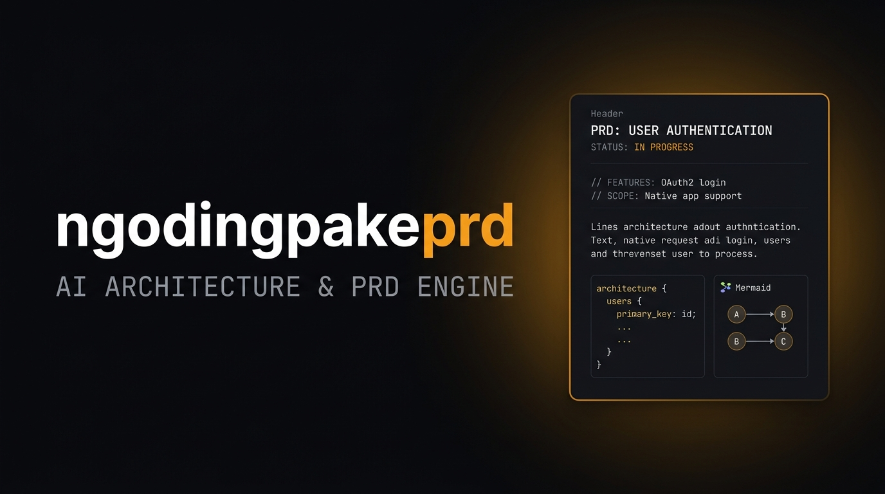

<div align="center">



<br />

# ngodingpakeprd

**AI Architecture & Modern PRD Engine**

Generate PRD profesional, diagram arsitektur, dan starter kit siap pakai — dalam hitungan detik.

[](https://nextjs.org)
[](https://typescriptlang.org)
[](https://supabase.com)
[](https://tailwindcss.com)
[](#)

[🔗 Live Demo](https://ngodingpakeprd.com) · [📋 Privacy Policy](/privacy) · [📄 Terms of Service](/terms)

</div>

---

## Apa itu ngodingpakeprd?

**ngodingpakeprd** adalah platform berbasis AI yang mengubah ide produk satu kalimat menjadi dokumen PRD standar industri lengkap dengan diagram arsitektur teknis — siap dieksekusi oleh AI coding agent seperti Cursor, Claude Code, dan Roo Code.

### Masalah yang diselesaikan

Developer dan founder sering membuang berjam-jam untuk menyusun PRD, mendefinisikan arsitektur database, dan membuat blueprint sistem sebelum bisa mulai koding. ngodingpakeprd menghapus seluruh fase itu.

---

## Fitur Utama

| Fitur | Deskripsi |
|---|---|
| **PRD 7 Kategori** | Dokumen PRD terstruktur: Overview, Goals, User Stories, Features, Tech Stack, Database Schema, Timeline |
| **5 Diagram Arsitektur** | C4 System, Sequence Flow, ERD Database, State Machine, Feature Mindmap — semua format `.mmd` |
| **Starter Kit .ZIP** | Bundle siap pakai: `PRD.md`, `DESIGN.md`, `.cursorrules`, diagram `.mmd` |
| **Wizard Mode** | Mode interaktif untuk eksplorasi ide sebelum generate PRD |
| **Deep Feature Architecture** | Breakdown fitur P0/P1 berbasis domain: SaaS, Marketplace, Mobile, Game, API, Internal Tool |
| **ProChat AI Architect** | Diskusi arsitektur secara live dengan AI untuk refinement PRD |
| **Admin Dashboard** | Control plane lengkap: AI engine router, user management, payment approval |
| **Sistem Pembayaran** | QRIS GoPay integration dengan verifikasi manual admin |

---

## Tech Stack

```
Frontend    Next.js 16.3.5 + React 19 + TypeScript 5
Styling     Tailwind CSS 4
Database    Supabase (PostgreSQL) + Row Level Security
Auth        Supabase Auth — Google OAuth
AI Engine   Gemini Direct / OpenRouter / 9Router (multi-provider)
Diagrams    Mermaid.js 12
Deploy      Docker + Coolify / Vercel
```

---

## Cara Jalankan Lokal

### Prerequisites
- Node.js 20+
- Akun Supabase (gratis)
- Google Cloud OAuth credentials
- Gemini API Key (gratis dari [aistudio.google.com](https://aistudio.google.com))

### Setup

```bash
# 1. Clone repo
git clone https://github.com/daerobi-devs/ngodingpakeai.git
cd ngodingpakeai

# 2. Install dependencies
npm install

# 3. Copy env template
cp .env.example .env.local

# 4. Isi .env.local dengan kredensial kamu (lihat seksi Environment Variables)

# 5. Jalankan development server
npm run dev
```

Buka [http://localhost:3000](http://localhost:3000).

---

## Environment Variables

Buat file `.env.local` di root project:

```env
# Supabase
NEXT_PUBLIC_SUPABASE_URL=https://your-project.supabase.co
NEXT_PUBLIC_SUPABASE_ANON_KEY=your-anon-key
SUPABASE_SERVICE_ROLE_KEY=your-service-role-key

# Admin
ADMIN_PASSCODE=your-strong-passcode-here
ADMIN_SECRET_KEY=your-secret-key
```

---

## Deploy dengan Docker (Coolify)

```bash
# Build image
docker build -t ngodingpakeprd .

# Jalankan
docker run -p 3000:3000 \
  -e NEXT_PUBLIC_SUPABASE_URL=... \
  -e NEXT_PUBLIC_SUPABASE_ANON_KEY=... \
  -e SUPABASE_SERVICE_ROLE_KEY=... \
  -e ADMIN_PASSCODE=... \
  ngodingpakeprd
```

Untuk Coolify: tambahkan repository ini, pilih **Dockerfile** sebagai build method, set semua environment variables di dashboard Coolify.

---

## Database Setup

Jalankan `admin_setup.sql` di Supabase SQL Editor untuk setup tabel admin dan RLS policies. Lihat file [`admin_setup.sql`](./admin_setup.sql).

---

## Struktur Proyek

```
src/
├── app/
│   ├── admin/          # Stealth admin dashboard
│   ├── api/            # API routes (generate-prd, orders, admin, ...)
│   ├── generator/      # Generator Studio
│   ├── privacy/        # Halaman Privacy Policy
│   └── terms/          # Halaman Terms of Service
├── components/
│   ├── landing/        # Komponen landing page
│   ├── wizard/         # Wizard Mode steps
│   └── ...
└── lib/
    ├── ai/             # AI service layer (multi-provider)
    ├── gemini/         # Gemini client + prompts
    └── supabase/       # Supabase client + types
```

---

## Kontribusi

Proyek ini bersifat **private**. Tidak menerima kontribusi eksternal saat ini.

---

## Legal

- [Privacy Policy](https://ngodingpakeprd.com/privacy)
- [Terms of Service](https://ngodingpakeprd.com/terms)

---

<div align="center">
  <sub>Built by <a href="https://github.com/daerobi-devs">@daerobi-devs</a> · ngodingpakeprd &copy; 2026</sub>
</div>
