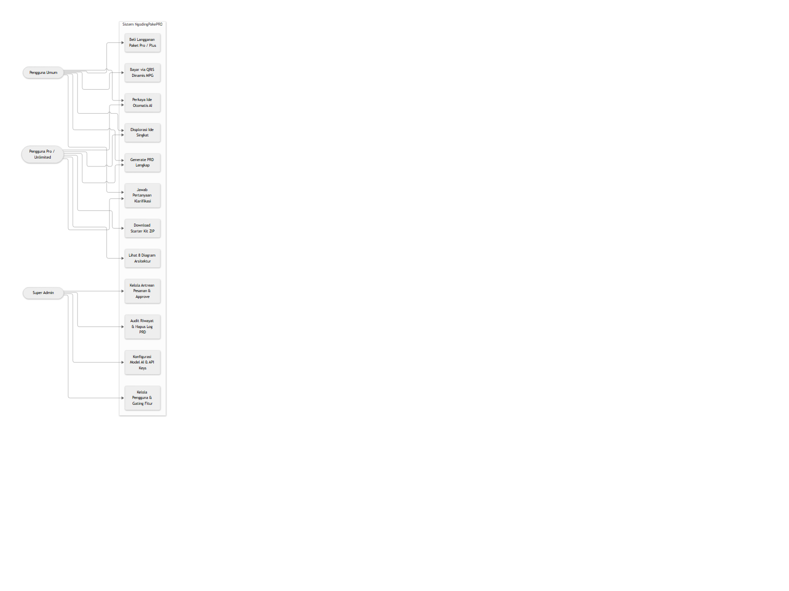
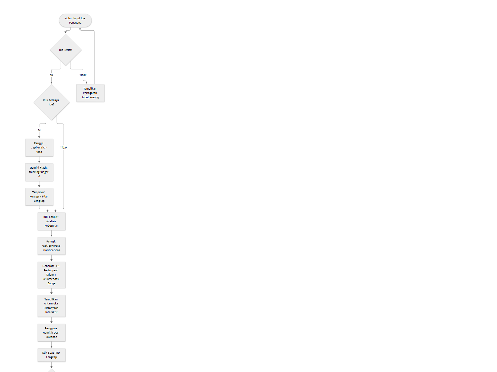
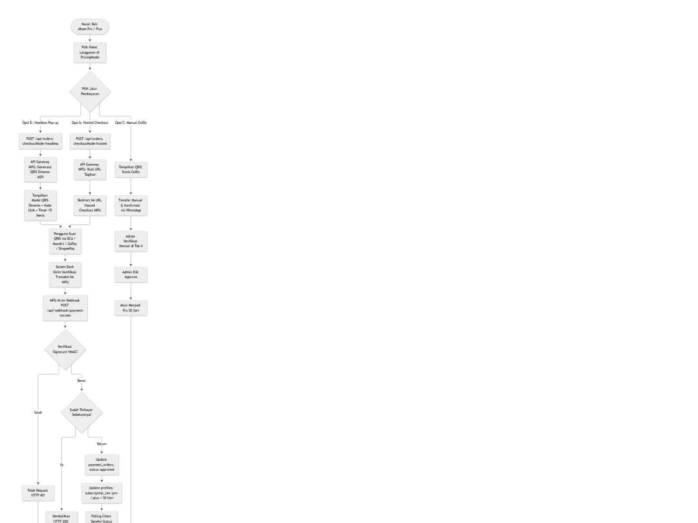
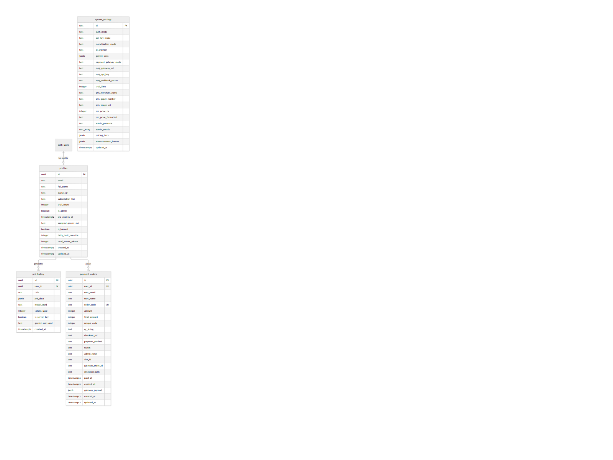
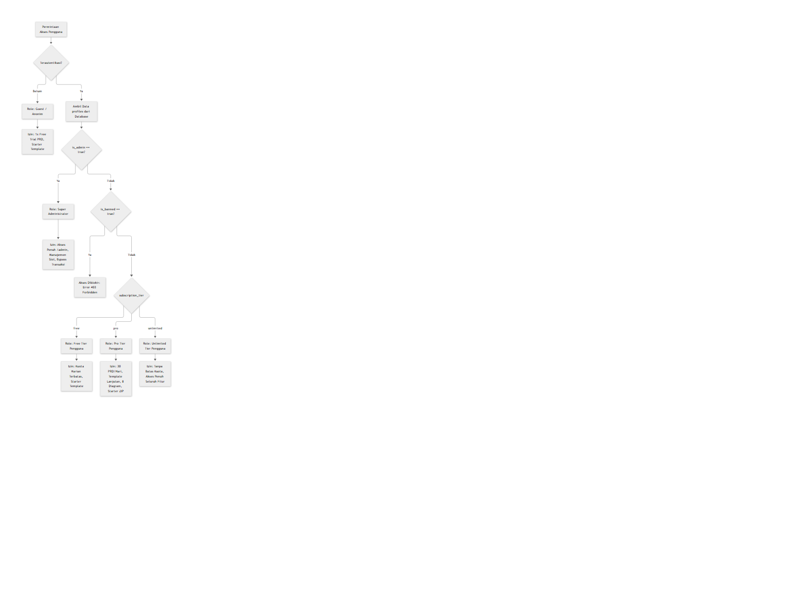
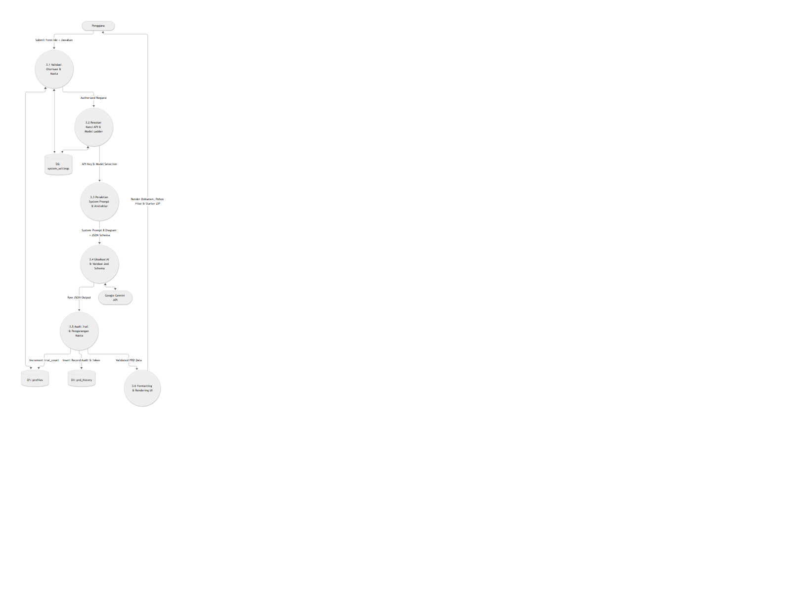
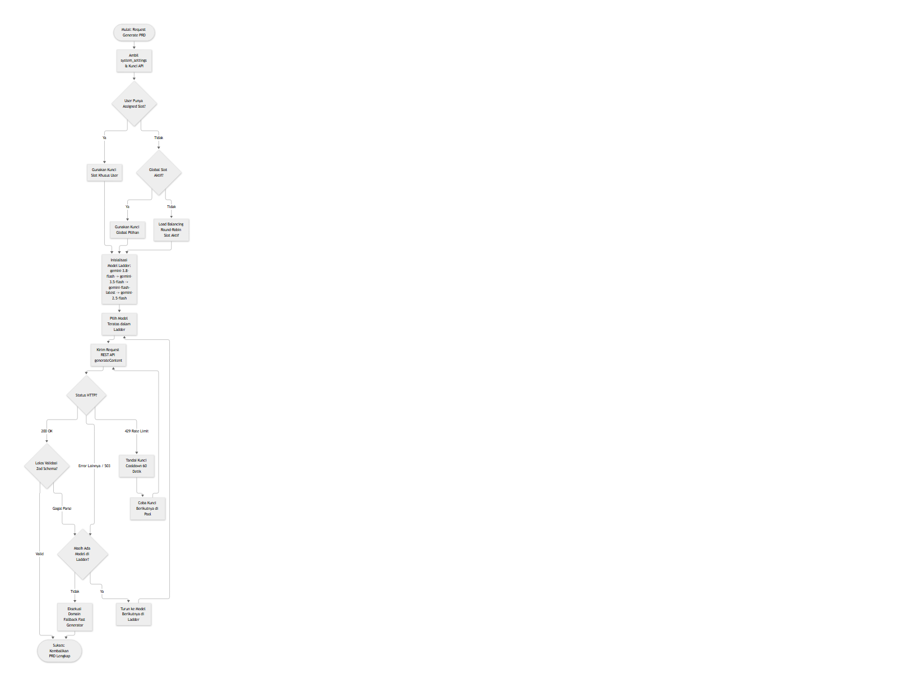
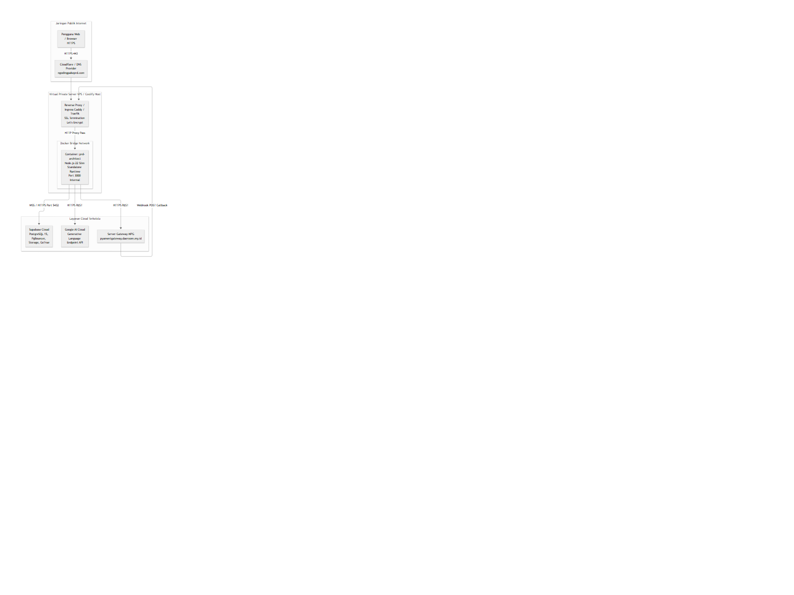
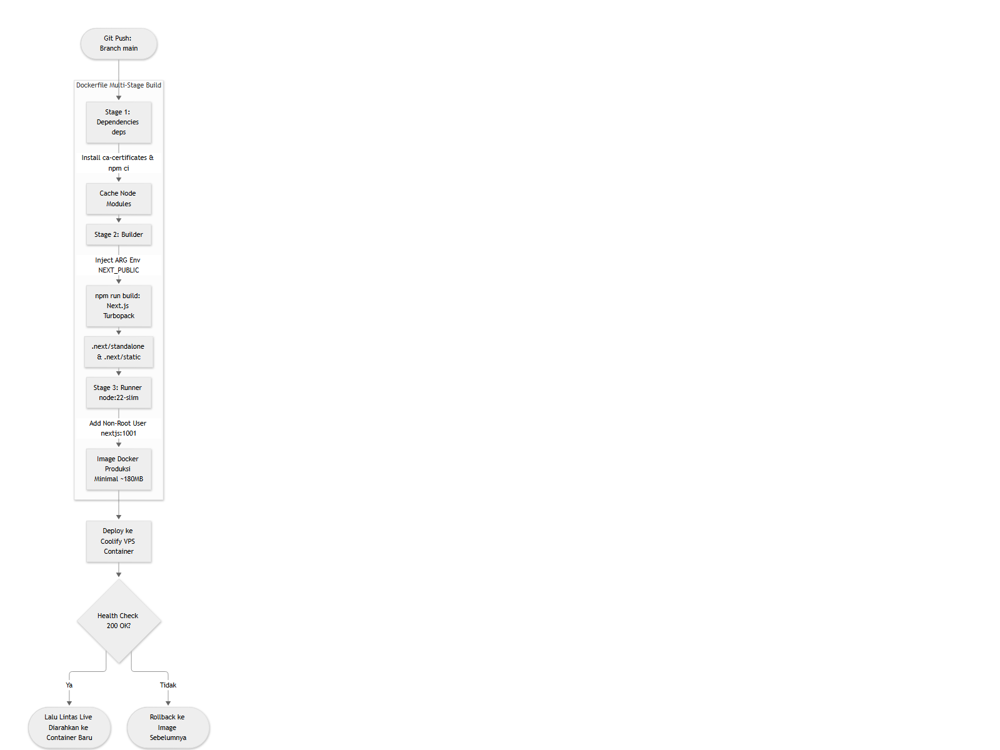

# LAPORAN TEKNIS SISTEM NGODINGPAKEPRD (PRD-ARCHITECT)
**Sistem Generator Dokumen Spesifikasi Kebutuhan Produk & Arsitektur Perangkat Lunak Berbasis Kecerdasan Buatan Terpadu**

---

**Informasi Dokumen:**
* Nama Sistem: NgodingPakePRD (`prd-architect` v0.1.0)
* Domain Produksi: `ngodingpakeprd.com`
* Tanggal Audit: 20 September 2026
* Klasifikasi: Dokumen Teknis Arsitektur Sistem
* Standar Format: Markdown Formal, 8-Diagram Visual Mermaid.js & C4 Model

---

## DAFTAR ISI

1. [Bab 1: Ringkasan Eksekutif](#bab-1-ringkasan-eksekutif)
2. [Bab 2: Latar Belakang, Tujuan, dan Ruang Lingkup Sistem](#bab-2-latar-belakang,-tujuan,-dan-ruang-lingkup-sistem)
3. [Bab 3: Tech Stack dan Landasan Teknologi](#bab-3-tech-stack-dan-landasan-teknologi)
4. [Bab 4: Arsitektur Sistem dan Pola Desain](#bab-4-arsitektur-sistem-dan-pola-desain)
5. [Bab 5: Struktur Project dan Penjelasan Kode Sumber](#bab-5-struktur-project-dan-penjelasan-kode-sumber)
6. [Bab 6: Analisis Kebutuhan Sistem](#bab-6-analisis-kebutuhan-sistem)
7. [Bab 7: Penjelasan Mendalam Fitur Sistem](#bab-7-penjelasan-mendalam-fitur-sistem)
8. [Bab 8: Arsitektur Frontend dan Komponen Antarmuka](#bab-8-arsitektur-frontend-dan-komponen-antarmuka)
9. [Bab 9: Arsitektur Backend dan Spesifikasi API](#bab-9-arsitektur-backend-dan-spesifikasi-api)
10. [Bab 10: Basis Data dan Pemodelan Data](#bab-10-basis-data-dan-pemodelan-data)
11. [Bab 11: Autentikasi dan Otorisasi Sistem](#bab-11-autentikasi-dan-otorisasi-sistem)
12. [Bab 12: Alur Data Sistem (Data Flow)](#bab-12-alur-data-sistem-(data-flow))
13. [Bab 13: Integrasi Layanan Pihak Ketiga](#bab-13-integrasi-layanan-pihak-ketiga)
14. [Bab 14: Konfigurasi dan Variabel Lingkungan (Environment Variables)](#bab-14-konfigurasi-dan-variabel-lingkungan-(environment-variables))
15. [Bab 15: Deployment dan Arsitektur Infrastruktur](#bab-15-deployment-dan-arsitektur-infrastruktur)
16. [Bab 16: Analisis Keamanan dan Manajemen Risiko](#bab-16-analisis-keamanan-dan-manajemen-risiko)
17. [Bab 17: Analisis Performa dan Skalabilitas Sistem](#bab-17-analisis-performa-dan-skalabilitas-sistem)
18. [Bab 18: Strategi Pengujian Sistem (Testing Strategy)](#bab-18-strategi-pengujian-sistem-(testing-strategy))
19. [Bab 19: Keterbatasan Sistem, Technical Debt, dan Roadmap Pengembangan](#bab-19-keterbatasan-sistem,-technical-debt,-dan-roadmap-pengembangan)
20. [Bab 20: Panduan Menjalankan Sistem dan Panduan Pengguna](#bab-20-panduan-menjalankan-sistem-dan-panduan-pengguna)
21. [Bab 21: Glosarium Istilah dan Lampiran Dokumen](#bab-21-glosarium-istilah-dan-lampiran-dokumen)

---

# Bab 1: Ringkasan Eksekutif

## 1.1 Identitas dan Profil Sistem
Sistem yang dianalisis dan didokumentasikan dalam laporan teknis ini adalah **NgodingPakePRD** (secara internal diidentifikasi sebagai package `prd-architect` versi 0.1.0, dengan domain produksi `ngodingpakeprd.com`). Platform ini merupakan solusi rekayasa perangkat lunak berbasis web modern yang dirancang untuk mengotomatisasi penyusunan Dokumen Spesifikasi Kebutuhan Produk (*Product Requirement Document* / PRD) kelas enterprise, perancangan arsitektur multi-diagram, dekomposisi modul fitur bertahap, serta pembuatan bundel kode permulaan (*starter kit boilerplate*).

## 1.2 Masalah yang Diselesaikan
Dalam siklus pengembangan perangkat lunak tradisional maupun modern, terdapat jurang pemisah yang lebar antara ide konseptual bisnis dengan implementasi teknis oleh tim pengembang:
1. **Ketidaklengkapan Spesifikasi Kebutuhan**: Ide bisnis yang diajukan oleh *founder*, mahasiswa, maupun klien sering kali hanya berupa kalimat ringkas 2 hingga 5 kata tanpa batasan ruang lingkup, skema data, maupun mitigasi *edge cases*.
2. **Keterbatasan Pemahaman Arsitektur**: Pengembang pemula dan UMKM sering kali kesulitan memetakan kebutuhan bisnis ke dalam struktur teknis nyata seperti diagram alur (*flowcharts*), relasi entitas basis data (*ERD*), kontrak API (*REST specification*), serta pemetaan hak akses berbasis peran (*RBAC*).
3. **Friksi Pembuatan Boilerplate**: Memulai proyek perangkat lunak dari nol memerlukan waktu berjam-jam untuk menyiapkan struktur folder, dependensi, aturan *linter*, skrip inisialisasi basis data, dan konfigurasi Docker.
4. **Biaya Konsultasi dan API Komersial yang Tinggi**: Banyak alat bantu manajemen produk komersial mengenakan biaya langganan bulanan mahal atau mewajibkan pengguna memiliki kunci API AI sendiri (*Bring Your Own Key* / BYOK) yang rumit bagi pengguna non-teknis.

## 1.3 Solusi dan Gambaran Cara Kerja Sistem
NgodingPakePRD menyelesaikan permasalahan tersebut melalui orkestrasi kecerdasan buatan terpadu (*Generative AI Engine Orchestration*) yang menggabungkan:
1. **Interactive Idea Refinement & Domain Discovery**: Mengubah ide mentah pengguna menjadi konsep arsitektur 4 pilar yang komprehensif, diikuti dengan analisis domain otomatis yang menyodorkan 3 hingga 4 pertanyaan penemuan teknis berbobot lengkap dengan lencana rekomendasi (*smart recommendation badges*).
2. **Deterministic Architecture Synthesis**: Menggunakan model bahasa besar Google Gemini (dengan hierarki model ladder `gemini-3.8-flash` -> `gemini-3.5-flash` -> `gemini-flash-latest` -> `gemini-2.5-flash`) yang dikunci dengan *JSON Schema* dan validasi ketat pustaka *Zod* untuk menghasilkan PRD berstruktur konsisten, bebas halusinasi, dan mencakup 8 diagram visual berbasis *Mermaid.js*.
3. **Phased Feature Tree Visualization**: Merender pohon dekomposisi fitur produk menggunakan kurva kurvatur SVG Bezier yang elegan, interaktif, dan membagi rilis fitur ke dalam tahapan MVP, Fase Lanjutan, dan Skala Masa Depan.
4. **Starter Kit Export Engine**: Memungkinkan pengguna mengunduh seluruh artefak perencanaan ke dalam arsip file `.zip` yang berisi dokumen `.cursorrules`, panduan desain antarmuka `DESIGN.md`, skrip SQL skema Supabase, serta dokumen PRD format Markdown dan JSON mentah.
5. **Headless Dynamic Payment Gateway (MPG)**: Mengintegrasikan sistem pembayaran mandiri berbasis QRIS Dinamis ASPI EMVCo dengan MDR 0% dan verifikasi mutasi otomatis secara *idempotent* melalui tanda tangan kriptografi HMAC-SHA256.

Dokumen ini disusun sebagai catatan audit teknis menyeluruh, mencakup seluruh lapisan arsitektur, kode sumber, basis data, keamanan, serta instruksi operasional sistem.


---


# Bab 2: Latar Belakang, Tujuan, dan Ruang Lingkup Sistem

## 2.1 Latar Belakang
Era kecerdasan buatan generatif telah mengubah paradigma rekayasa perangkat lunak. *AI coding assistants* seperti Claude Code, GitHub Copilot, Cursor, dan Windsurf telah mempercepat penulisan kode sumber secara drastis. Namun, efektivitas agen AI tersebut sangat bergantung pada kualitas instruksi awal (*prompt engineering*) dan kejelasan spesifikasi kebutuhan teknis. Fenomena *"Garbage In, Garbage Out"* menjadi hambatan utama: ketika pengguna hanya memberikan instruksi singkat tanpa spesifikasi arsitektur yang matang, kode yang dihasilkan AI cenderung parsial, tidak konsisten, dan rentan terhadap kegagalan integrasi.

Platform NgodingPakePRD hadir untuk menjadi jembatan formal (*formal bridge*) yang mengubah ide abstrak pengguna menjadi cetak biru teknis (*technical blueprint*) tingkat industri yang siap dieksekusi oleh developer manusia maupun agen coding AI otonom.

## 2.2 Tujuan Pengembangan Sistem
Tujuan utama yang dicapai oleh sistem ini meliputi:
1. **Menghilangkan Ambiguitas Kebutuhan**: Mengembangkan modul klarifikasi cerdas yang mampu mengidentifikasi domain bisnis secara otomatis dan mengajukan opsi arsitektur dengan penanda rekomendasi teknis terbaik.
2. **Menyediakan Standardisasi Dokumen PRD**: Menghasilkan dokumen PRD yang memuat 10 bagian wajib standar industri: pernyataan masalah, target audiens, *user stories* bersyarat penerimaan (*acceptance criteria*), rincian modul fitur, 8 diagram arsitektur interaktif, spesifikasi kontrak API REST, skema basis data relasional PostgreSQL, dekomposisi *edge cases*, panduan UI/UX, dan *roadmap* implementasi bertahap.
3. **Menyediakan Visualisasi Grafis Arsitektur Terintegrasi**: Mengeliminasi kebutuhan aplikasi diagram terpisah dengan menyematkan visualisasi *Mermaid.js* dinamis yang mendukung *zoom*, *pan*, dan unduh grafis langsung di peramban.
4. **Membangun Sistem Akses Mandiri yang Fleksibel**: Menyediakan model akses *Freemium* yang adil dengan kuota gratis harian, dukungan kunci pribadi (*BYOK*), serta langganan *Plus* dan *Pro* dengan transaksi instan berbasis QRIS dinamis mandiri tanpa potongan biaya pihak ketiga (*0% MDR*).
5. **Menyediakan Pusat Kendali Administratif Terpadu**: Memberikan fasilitas bagi *Super Administrator* untuk mengelola alokasi kunci API AI (*Gemini Slot Pool*), memantau pemakaian token server, memverifikasi pesanan pembayaran, serta mengatur *switchboard* fitur sistem secara langsung tanpa perlu melakukan redeploy aplikasi.

## 2.3 Ruang Lingkup Sistem
Ruang lingkup yang dicakup oleh sistem NgodingPakePRD meliputi:
* **Ruang Lingkup Pengguna**:
  * Pengguna Publik / Pengunjung: Menjelajahi antarmuka landing page, memanfaatkan *Interactive Blueprint Studio*, melihat simulasi workflow, dan mencoba 1 kali pembuatan PRD percobaan gratis.
  * Pengguna Terdaftar (Free Tier): Masuk menggunakan Google OAuth atau Magic Link OTP, membuat PRD dengan kuota harian standar, melihat pohon fitur, dan menyalin PRD.
  * Pengguna Berlangganan (Plus & Pro): Membuka akses ke template lanjutan (*Mobile App*, *AI Agent & Vector Service*, *Custom Tech Stack*), membuka akses 8 diagram arsitektur, dan mengunduh paket arsip *Starter Kit ZIP*.
* **Ruang Lingkup Fungsional**:
  * Modul *Hero Input* dan *Auto-Enrichment* ide berbasis Gemini Flash (thinking budget dinolkan).
  * Modul *Domain Discovery* dan *Smart Clarification Questions*.
  * Modul Sintesis Dokumen PRD Terstruktur berbasis Zod Schema dan *Model Fallback Ladder*.
  * Modul *Viewer* PRD tipe alir (*clean typography flow*) dengan pohon dekomposisi fitur kurva Bezier SVG.
  * Modul Pembayaran terintegrasi Mandiri Private Gateway (MPG) dengan 3 opsi jalur (Headless QRIS Pop-up, Hosted Redirect, dan Manual GoBiz).
  * Modul Dashboard Administrator 6 Tab dengan tema dinamis (Mode Terang Biru & Putih serta Mode Gelap).
* **Batasan Sistem (Out of Scope)**:
  * Sistem tidak mengeksekusi *compiler* atau menjalankan *runtime* aplikasi yang dirancang; sistem hanya berfokus pada perancangan arsitektur, spesifikasi teknis, dan *scaffolding*.
  * Sistem tidak menyediakan *hosting* bagi aplikasi yang dihasilkan oleh pengguna.


---


# Bab 3: Tech Stack dan Landasan Teknologi

## 3.1 Daftar Teknologi Utama
Berdasarkan audit konfigurasi dependensi pada file `package.json`, konfigurasi `next.config.ts`, `tsconfig.json`, dan file lingkungan `.env.example`, sistem dibangun di atas tumpukan teknologi modern berkinerja tinggi sebagai berikut:

| Kategori | Teknologi | Versi | Fungsi dalam Sistem | Alasan Pemilihan Teknis | Bukti File Sumber |
| :--- | :--- | :--- | :--- | :--- | :--- |
| **Framework Utama** | Next.js (App Router) | 16.3.5 | Web framework full-stack, Server Components & Route Handlers | Arsitektur full-stack terpadu, SSR/SSG, kompilasi Turbopack super cepat, dan output standalone untuk Docker | `package.json`, `next.config.ts` |
| **Library UI** | React & React-DOM | 19.2.8 | Antarmuka pengguna reaktif dan rendering berbasis komponen | Fitur React 19 terbaru (Actions, Server Components, Hooks modern) | `package.json` |
| **Bahasa Pemrograman** | TypeScript | ^5.0.0 | Bahasa pemrograman dengan sistem pengetikan statis (*static typing*) | Keamanan tipe menyeluruh (*end-to-end type safety*), meminimalkan runtime error, dan integrasi mulus dengan schema Zod | `tsconfig.json`, `package.json` |
| **Styling & CSS** | TailwindCSS | ^4.0.0 | Framework utility-first CSS | Mesin Tailwind v4 berkecepatan tinggi berbasis PostCSS, tanpa konfigurasi kompleks, ukuran bundle CSS sangat ringkas | `package.json`, `src/app/globals.css` |
| **Validasi Skema** | Zod | ^4.6.5 | Validasi runtime schema dan parsing JSON respons AI | Menjamin output AI sesuai dengan struktur data yang diharapkan aplikasi sebelum dirender | `package.json`, `src/lib/gemini/schemas.ts` |
| **Basis Data & Auth** | Supabase (PostgreSQL) | ^2.116.0 | Database relasional PostgreSQL, Row Level Security (RLS), dan Autentikasi | Basis data relasional enterprise, penyimpanan JSONB fleksibel, serta auth OAuth/OTP terintegrasi | `src/lib/supabase/client.ts`, `supabase_schema.sql` |
| **Supabase SSR** | @supabase/ssr | ^0.12.7 | Manajemen sesi auth berbasis cookie pada Next.js Server & Client | Penanganan autentikasi yang aman di sisi server (Server Actions & Route Handlers) menggunakan cookie HTTP-Only | `package.json`, `src/lib/supabase/server.ts` |
| **AI SDK** | @google/genai & @google/generative-ai | ^2.22.0 / ^0.24.1 | SDK resmi Google Gemini AI | Akses langsung ke model Gemini 2.5, 3.5, dan 3.8 Flash melalui Google AI Studio | `package.json`, `src/lib/gemini/gemini-client.ts` |
| **Visualisasi Diagram** | Mermaid.js | ^12.0.0 | Rendering diagram grafis teknis berbasis sintaks teks deklaratif | Standar de-facto diagram teknis (Flowchart, ERD, Sequence, C4, GitGraph) tanpa ketergantungan server | `package.json`, `src/components/MermaidRenderer.tsx` |
| **Ikonografi** | Lucide React | ^1.46.0 | Koleksi ikon vektor SVG bersih dan konsisten | Standar antarmuka profesional tanpa ketergantungan aset raster, mendukung zero emoji policy | `package.json`, `src/components/Navbar.tsx` |
| **Penyusunan Arsip** | JSZip | ^3.10.2 | Pembuatan file arsip .ZIP di peramban klien | Mengompres starter kit, aturan linter, skema SQL, dan dokumen PRD menjadi satu file unduhan | `package.json`, `src/components/PRDViewer.tsx` |
| **Barcode Generator** | qrcode.react | ^4.2.0 | Rendering barcode QRIS SVG / Canvas interaktif | Menampilkan barcode QRIS dinamis berstandar ASPI EMVCo langsung di modal pembayaran tanpa latensi jaringan | `package.json`, `src/components/PricingModal.tsx` |
| **Efek Animasi** | canvas-confetti | ^1.9.4 | Partikel selebrasi pada canvas | Umpan balik visual yang menyenangkan saat transaksi pembayaran berhasil diverifikasi | `package.json`, `src/app/generator/page.tsx` |

## 3.2 Lingkungan Runtime dan Kontainerisasi
* **Runtime**: Node.js versi 22 LTS (berbasis image Docker `node:22-slim`).
* **Container Engine**: Docker multi-stage build dengan optimasi *standalone output* Next.js, menghasilkan image produksi ringkas (~180 MB) dengan hak akses pengguna non-root (`nextjs:1001`) demi keamanan server.
* **Orkestrasi Deployment**: Kompatibel dengan Coolify, Portainer, Docker Compose, maupun Kubernetes.


---


# Bab 4: Arsitektur Sistem dan Pola Desain

## 4.1 Pola Arsitektur Keseluruhan
Sistem NgodingPakePRD mengadopsi pola arsitektur **Modern Full-Stack Jamstack / Serverless-Ready Architecture** berbasis Next.js App Router yang terdistribusi ke dalam 4 tingkatan (*4-tier architecture*):
1. **Presentation Tier (Client Side)**: Berjalan di browser pengguna menggunakan React 19 Client Components, mengelola *client state* lokal, *optimistic UI updates*, interaktivitas visualisasi grafis SVG, serta rendering diagram *Mermaid.js*.
2. **Application & Routing Tier (Server Side)**: Berjalan di Node.js 22 runtime sebagai Next.js Server Components dan API Route Handlers, menangani validasi keamanan, pemeriksaan otorisasi sesi, orkestrasi panggilan model AI, dan manajemen *webhook*.
3. **Data & Persistence Tier (Database Side)**: Layanan terkelola Supabase PostgreSQL yang dilindungi oleh *Row Level Security* (RLS), menangani integritas referensial, tabel relasional, serta pencatatan log audit bertipe JSONB.
4. **External Services Tier (Cloud Integrations)**: Endpoint REST eksternal Google AI Studio (Gemini Language API) dan gateway pembayaran Mandiri Private Gateway (MPG).

## 4.2 Diagram Arsitektur C4 Model
Untuk mendokumentasikan arsitektur sistem secara komprehensif berstandar internasional, arsitektur diuraikan menggunakan pendekatan **C4 Model** (Context, Container, Component):

### Gambar 1: C4 Model Level 1 - System Context Diagram

*Gambar 1: C4 Model Level 1 - System Context Diagram*

* **Cara Membaca Diagram**: Diagram di atas menggambarkan batasan sistem NgodingPakePRD dalam hubungannya dengan tiga aktor pengguna (Pengguna Umum, Pengguna Pro/Unlimited, dan Super Administrator) serta tiga layanan eksternal utama (Google Gemini API, Gateway Pembayaran MPG, dan Layanan Cloud Supabase).
* **Penjelasan Naratif**: Pengguna umum dan pro berinteraksi dengan sistem untuk membuat spesifikasi teknis dan melakukan transaksi pembayaran QRIS. Super Administrator berinteraksi untuk mengontrol sistem switchboard dan alokasi kuota. Sistem secara otonom meneruskan prompt ke Google Gemini, memvalidasi pembayaran ke MPG, dan menyimpan status pengguna di Supabase.

---

### Gambar 2: C4 Model Level 2 - Container Diagram

*Gambar 2: C4 Model Level 2 - Container Diagram*

* **Cara Membaca Diagram**: Diagram Container menguraikan unit-unit perangkat lunak independen yang dapat dieksekusi di dalam sistem.
* **Penjelasan Naratif**: Container utama adalah Next.js 16 Application Server (Node.js 22) yang membungkus antarmuka SPA Frontend React 19, API Route Handlers, dan Supabase SSR Cookie Auth Handler. Container basis data berada di Supabase (PostgreSQL + GoTrue Auth), sedangkan layanan eksternal dihubungkan via koneksi HTTPS terenkripsi TLS 1.3.

---

### Gambar 3: C4 Model Level 3 - Component Diagram

*Gambar 3: C4 Model Level 3 - Component Diagram*

* **Cara Membaca Diagram**: Diagram Komponen membedah modul internal di dalam container Next.js API Routes dan pustaka inti (*src/lib/*).
* **Penjelasan Naratif**: Modul API (`enrich-idea`, `generate-clarifications`, `generate-prd`, `orders`, `webhook`, `admin`) bertindak sebagai pengontrol yang mengonsumsi pustaka modular: `gemini-client.ts` untuk manajemen ladder model dan rotasi kunci, `prompts.ts` untuk rekayasa instruksi, `schemas.ts` untuk penegakan kontrak Zod, `client.ts` untuk integrasi gateway MPG, dan `admin.ts` untuk klien Supabase dengan Service Role privileges.

---

### Gambar 4: Diagram Arsitektur Sistem Keseluruhan

*Gambar 4: Diagram Arsitektur Sistem Keseluruhan*

* **Cara Membaca Diagram**: Diagram di atas memperlihatkan interaksi komprehensif antara Client Presentation Tier, Server Application Tier, Data Persistence Tier, dan External Infrastructure Tier secara vertikal.


---


# Bab 5: Struktur Project dan Penjelasan Kode Sumber

## 5.1 Pohon Struktur Direktori
Berikut adalah pemetaan pohon direktori kode sumber sistem (mengabaikan `node_modules`, `.next`, dan `.git`):

```text
d:/PAKEPRDAJA/
├── .env.example                       # Template variabel lingkungan sistem
├── .env.local                          # Variabel lingkungan lokal privat (tidak di-commit)
├── .gitignore                          # Konfigurasi pengabaian Git
├── Dockerfile                          # Multi-stage Dockerfile (deps, builder, runner)
├── next.config.ts                      # Konfigurasi Next.js 16, security headers & standalone
├── package.json                        # Daftar dependensi, skrip npm, dan metadata proyek
├── postcss.config.mjs                  # Konfigurasi TailwindCSS PostCSS
├── tsconfig.json                       # Konfigurasi compiler TypeScript 5
├── admin_setup.sql                     # Skrip SQL inisialisasi akun Super Administrator
├── supabase_schema.sql                 # Skrip SQL skema master basis data Supabase
├── supabase_migration_v2.sql           # Skrip SQL migrasi slot Gemini dan tier pricing
├── supabase_migration_mpg.sql          # Skrip SQL migrasi Mandiri Private Gateway (MPG)
├── token_and_history_setup.sql         # Skrip SQL migrasi audit kuota & token history
├── docs/                               # Dokumentasi teknis sistem & diagram
│   ├── diagrams/                       # Sumber Mermaid (.mmd) dan hasil render (.svg, .png)
│   ├── laporan/                        # File laporan teknis Bab 1 - 21 & LAPORAN_LENGKAP
│   └── proposal/                       # File proposal bisnis & teknis
├── public/                             # Aset statis publik (favicon, ikon, open-graph)
└── src/
    ├── app/                            # Next.js 16 App Router (Halaman & Endpoint API)
    │   ├── layout.tsx                  # Root Layout, AuthProvider & global theme
    │   ├── page.tsx                    # Landing Page utama & Blueprint Studio
    │   ├── globals.css                 # CSS global, styling utility & scrollbar
    │   ├── admin/                      # Halaman Master Dashboard Admin 6 Tab
    │   │   └── page.tsx                # Implementasi lengkap Admin Control Center
    │   ├── generator/                  # Halaman Ruang Kerja Pembuat PRD
    │   │   └── page.tsx                # Implementasi wizard, viewer, dan visualizer
    │   ├── privacy/page.tsx            # Halaman Kebijakan Privasi
    │   ├── terms/page.tsx              # Halaman Syarat dan Ketentuan Layanan
    │   ├── auth/callback/route.ts      # Handler pertukaran token OAuth / Magic Link
    │   └── api/                        # Next.js Route Handlers (Backend API)
    │       ├── admin/route.ts          # Endpoint kontrol operasi admin
    │       ├── assist-section/route.ts # Endpoint asisten revisi sub-seksi PRD
    │       ├── autofill-prd/route.ts   # Endpoint pelengkap formulir cepat
    │       ├── enrich-idea/route.ts    # Endpoint elaborasi ide konsep 4 pilar
    │       ├── generate-clarifications/# Endpoint penemuan domain & pertanyaan
    │       │   └── route.ts
    │       ├── generate-prd/route.ts   # Endpoint orkestrasi sintesis PRD utama
    │       ├── orders/route.ts         # Endpoint pembuatan invoice pesanan QRIS
    │       ├── profile/route.ts        # Endpoint verifikasi profil & kuota pengguna
    │       ├── settings/route.ts       # Endpoint konfigurasi publik sistem
    │       ├── stats/route.ts          # Endpoint statistik generasi komunitas ter-cache
    │       ├── user-prds/route.ts      # Endpoint riwayat PRD spesifik pengguna
    │       ├── validate-key/route.ts   # Endpoint validasi kunci Gemini BYOK
    │       └── webhook/                # Endpoint penanganan webhook pembayaran
    │           └── payment-success/
    │               └── route.ts        # Handler webhook instan MPG HMAC-SHA256
    ├── components/                     # Komponen Antarmuka Pengguna (UI Components)
    │   ├── AnnouncementBanner.tsx      # Banner pengumuman global dinamis
    │   ├── ApiKeyModal.tsx             # Modal input kunci BYOK Gemini
    │   ├── AuthModal.tsx               # Modal login Google OAuth & Magic Link
    │   ├── BeginnerRoadmap.tsx         # Panduan bertahap untuk pemula
    │   ├── ClarifierModal.tsx          # Modal pertanyaan klarifikasi cepat
    │   ├── CustomPaletteModal.tsx      # Modal pemilihan palet warna UI kustom
    │   ├── GeneratorSidebar.tsx        # Panel samping riwayat generasi pengguna
    │   ├── MermaidRenderer.tsx         # Renderer 8-diagram Mermaid dengan zoom/pan
    │   ├── MindmapViewer.tsx           # Visualisasi diagram mindmap konsep
    │   ├── Navbar.tsx                  # Navigasi utama dengan counter komunitas
    │   ├── OnboardingModal.tsx         # Modal sambutan panduan pengguna baru
    │   ├── PRDForm.tsx                 # Formulir konfigurasi PRD klasik
    │   ├── PRDViewer.tsx               # Penampil dokumen PRD alir bersih & TOC
    │   ├── PhasedFeatureTree.tsx       # Pohon fitur modul kurva kurvatur Bezier SVG
    │   ├── PricingModal.tsx            # Modal paket harga & 3-jalur pembayaran QRIS
    │   ├── SectionAssistantModal.tsx   # Modal asisten penyuntingan seksi PRD
    │   ├── ThemeToggle.tsx             # Switch mode tema terang/gelap
    │   ├── icons/TechIcons.tsx         # Koleksi ikon SVG teknologi (Next, React, dll)
    │   ├── landing/                    # Komponen khusus halaman depan (Landing Page)
    │   │   ├── InteractiveBlueprintStudio.tsx # Studio interaktif pratinjau PRD
    │   │   ├── LandingTemplateShowcase.tsx    # Galeri kartu preset arsitektur
    │   │   └── VisualWorkflowPipeline.tsx     # Alur animasi pipa kerja PRD
    │   └── wizard/                     # Komponen antarmuka wizard pembuatan PRD
    │       ├── CustomStackModal.tsx    # Modal peracik custom stack teknologi
    │       ├── WizardDiscoveryStep.tsx # Langkah interaktif pertanyaan & rekomendasi
    │       └── WizardHeroInput.tsx     # Input ide hero, template picker & enrich AI
    ├── context/                        # React Context State Management
    │   └── AuthContext.tsx             # Global Auth Provider (User, Tier, Settings)
    ├── lib/                            # Pustaka Utilitas & Integrasi Layanan
    │   ├── demo-data.ts                # Data contoh PRD lengkap untuk pratinjau
    │   ├── design-template.ts          # Generator dokumen DESIGN.md starter kit
    │   ├── form-presets.ts             # Preset formulir konfigurasi arsitektur
    │   ├── ai/                         # Pustaka pendukung model AI
    │   │   ├── ai-service.ts           # Abstraksi pemanggilan layanan AI
    │   │   └── openai-compat.ts        # Kompatibilitas format OpenAI / DeepSeek
    │   ├── gemini/                     # Mesin Utama Google Gemini Integration
    │   │   ├── domain-discovery.ts     # Logika deteksi domain & pertanyaan preset
    │   │   ├── gemini-client.ts        # Client SDK, Model Ladder & Key Pool Rotator
    │   │   ├── prompts.ts              # System prompt 8 diagram & rekayasa PRD
    │   │   └── schemas.ts              # Zod schema & Gemini responseSchema validator
    │   ├── mpg/                        # Mandiri Private Gateway (MPG) SDK
    │   │   └── client.ts               # Integrasi invoice, QRIS & verifikasi HMAC
    │   ├── supabase/                   # Supabase Database Client Modules
    │   │   ├── admin.ts                # Client Supabase Service Role (Akses Penuh)
    │   │   ├── client.ts               # Client Supabase Browser (Anon Key)
    │   │   ├── server.ts               # Client Supabase Server Actions & Route Handlers
    │   │   └── types.ts                # Definisi tipe tabel database PostgreSQL
    │   └── templates/archetypes.ts     # Definisi 4 arsitektur starter (Web, Mobile, AI, Custom)
    └── types/
        └── prd.ts                      # Definisi tipe antarmuka PRD & 8 Diagram
```

## 5.2 Peran dan Tanggung Jawab Direktori Kunci
1. **`src/app/api/`**: Bertanggung jawab sebagai *Backend-for-Frontend* (BFF). Seluruh komunikasi data sensitif (seperti pemanggilan kunci API Gemini Master dan verifikasi pembayaran) dieksekusi secara terisolasi di sisi server tanpa mengekspos kredensial ke peramban.
2. **`src/lib/gemini/`**: Jantung kecerdasan sistem. Mengelola toleransi kegagalan jaringan (*network resilience*), rotasi otomatis kunci API (*Key Pool Manager*), eskalasi model bertingkat (*Model Ladder*), serta penegakan validitas format data dengan Zod.
3. **`src/components/wizard/`**: Menangani pengalaman pengguna saat pertama kali menuangkan ide. Mengintegrasikan tombol *Perkaya Ide (AI)* yang sangat responsif, menu dropdown preset arsitektur, dan chip pertanyaan klarifikasi interaktif.
4. **`src/components/PRDViewer.tsx`**: Menangani penyajian dokumen teknis hasil kompilasi AI menggunakan tipografi mengalir bersih (*clean typography flow*) ala Notion atau Stripe Docs, lengkap dengan navigasi TOC *sticky* samping, pohon fitur SVG, dan 8 tab diagram Mermaid.


---


# Bab 6: Analisis Kebutuhan Sistem

## 6.1 Kebutuhan Fungsional (Functional Requirements)
Berdasarkan penelusuran kode sumber pada endpoint API dan komponen antarmuka, sistem memiliki kebutuhan fungsional utama sebagai berikut:

1. **FR-01 (Eksplorasi & Auto-Enrichment Ide)**:
   * Sistem harus mampu menerima masukan ide produk perangkat lunak mentah dari pengguna.
   * Sistem harus menyediakan fungsi perluasan ide otomatis berbasis AI (*POST /api/enrich-idea*) yang mentransformasikan teks singkat menjadi 4 pilar arsitektur komprehensif dalam waktu di bawah 3 detik tanpa terpotong (lihat: `src/app/api/enrich-idea/route.ts`).
   * Sistem harus menyediakan tombol pembatalan (*Undo*) untuk mengembalikan teks ide awal pengguna jika diinginkan (lihat: `src/components/wizard/WizardHeroInput.tsx`).

2. **FR-02 (Penemuan Domain & Pertanyaan Klarifikasi Cerdas)**:
   * Sistem harus mendeteksi secara otomatis domain bisnis dari ide pengguna (misal: E-Commerce, Rental/Booking, Properti/Kos, POS/Kasir, Absensi, SaaS, atau PPDB/Sekolah) (lihat: `src/lib/gemini/domain-discovery.ts`).
   * Sistem harus menghasilkan 3 hingga 4 pertanyaan penemuan teknis tajam dengan 3 hingga 4 opsi jawaban terstruktur.
   * Sistem harus menyertakan lencana rekomendasi arsitektur terbaik (*isRecommended: true*) pada 1-2 opsi per pertanyaan beserta penjelasan rasional teknis ringkas, serta memilihkan opsi rekomendasi tersebut secara otomatis (*auto-selection*) saat antarmuka dimuat (lihat: `src/components/wizard/WizardDiscoveryStep.tsx`).

3. **FR-03 (Sintesis Dokumen PRD & 8 Diagram Visual)**:
   * Sistem harus mampu mengorkestrasi model AI (Google Gemini) untuk menyusun PRD lengkap yang mencakup 10 seksi standar industri (lihat: `src/app/api/generate-prd/route.ts`).
   * Sistem harus menghasilkan sintaks deklaratif untuk 8 diagram arsitektur interaktif (*System Flowchart*, *User Journey Flow*, *Database ERD*, *API REST Matrix*, *Sequence Flow*, *Cloud Infrastructure Topology*, *Role-Based Access Control*, dan *Data Pipeline Flow*) (lihat: `src/lib/gemini/prompts.ts`, `src/types/prd.ts`).
   * Sistem harus memvalidasi output AI menggunakan skema Zod (*ClarificationOutputZodSchema* dan *PRDOutputZodSchema*) untuk menjamin konsistensi format data (lihat: `src/lib/gemini/schemas.ts`).

4. **FR-04 (Visualisasi Pohon Fitur Kurva Bezier SVG)**:
   * Sistem harus memetakan dekomposisi fitur modul PRD ke dalam representasi grafis pohon bertingkat (*Phased Feature Tree*) yang memisahkan modul inti dengan garis lengkung Bezier SVG dari node induk (*Root Node*) ke modul fungsional (*Module Cards*) dan sub-fitur (*Sub-Feature Nodes*) (lihat: `src/components/PhasedFeatureTree.tsx`).
   * Sistem harus melakukan sanitasi terhadap string sampah schema yang mungkin dihasilkan AI secara deterministik.

5. **FR-05 (Ekspor Dokumen & Starter Kit Boilerplate)**:
   * Sistem harus menyediakan fungsi ekspor dokumen ke dalam format Markdown murni (`.md`) dan JSON mentah (lihat: `src/components/PRDViewer.tsx`).
   * Sistem harus menyediakan fungsi pengunduhan paket arsip terkompresi (`.zip`) via *JSZip* yang berisi berkas aturan agen AI `.cursorrules`, panduan desain antarmuka `DESIGN.md`, skrip SQL skema basis data Supabase, serta dokumen PRD lengkap.

6. **FR-06 (Integrasi Pembayaran Dinamis & Manajemen Kuota)**:
   * Sistem harus mendukung 3 opsi pembayaran langganan tier Plus dan Pro: (A) Hosted Checkout Redirect, (B) Headless Pop-up QRIS Dinamis ASPI EMVCo, dan (C) Manual GoBiz QRIS (lihat: `src/components/PricingModal.tsx`, `src/lib/mpg/client.ts`).
   * Sistem harus menangani webhook notifikasi pembayaran masuk dari Mandiri Private Gateway (MPG) dengan verifikasi tanda tangan kriptografi HMAC-SHA256, memperbarui status pesanan menjadi *approved*, serta memperpanjang masa aktif akun selama 30 hari secara otomatis dan *idempotent* (lihat: `src/app/api/webhook/payment-success/route.ts`).

7. **FR-07 (Manajemen dan Switchboard Administrator)**:
   * Sistem harus menyediakan dasbor administrasi terproteksi passcode (*ADMIN_SECRET_KEY* / *admin_passcode*) yang mencakup 6 tab manajemen: Overview & Live Deletion, Kunci API & Slot Router, Manajemen Pengguna & Banned, Antrean Pesanan QRIS, Switchboard Fitur & Kuota, serta Pengaturan QRIS & Harga (lihat: `src/app/admin/page.tsx`, `src/app/api/admin/route.ts`).
   * Dasbor admin harus mendukung pergantian tema dinamis antara Mode Terang (kombinasi warna Biru & Putih) dan Mode Gelap dengan tabel yang beradaptasi penuh.

## 6.2 Kebutuhan Non-Fungsional (Non-Functional Requirements)
1. **NFR-01 (Kinerja & Kecepatan Respons)**:
   * Waktu respons elaborasi ide (*enrich-idea*) tidak boleh melebihi 4 detik pada koneksi internet normal (dioptimalkan via `thinkingBudget: 0`).
   * Pustaka *domain discovery fallback* harus mampu menyajikan pertanyaan rekomendasi instan di bawah 5 milidetik jika koneksi eksternal terganggu.
2. **NFR-02 (Keamanan Data & Privasi)**:
   * Kunci API rahasia (Gemini Master Keys, MPG Webhook Secret, Supabase Service Role Key) tidak boleh pernah terekspos ke sisi klien peramban.
   * Komunikasi antarperamban dan server wajib menggunakan enkripsi TLS 1.3 / HTTPS dengan header keamanan ketat (*Strict-Transport-Security*, *X-Frame-Options: SAMEORIGIN*, *X-Content-Type-Options: nosniff*).
3. **NFR-03 (Skalabilitas & Ketahanan Sistem)**:
   * Sistem menerapkan pola *Model Ladder* bertingkat untuk mengantisipasi batas kuota rate limit (HTTP 429) pada model Gemini tertentu, secara otomatis beralih ke model cadangan.
   * Sistem menerapkan mekanisme cooldown 60 detik pada kunci API yang mengalami pembatasan kuota (*Key Pool Manager*).
4. **NFR-04 (Kesesuaian Desain & Kepatuhan Nol Emoji)**:
   * Seluruh kode sumber, basis data, antarmuka pengguna, dan dokumen sistem wajib mematuhi aturan *Zero Emoji* secara absolut, menggantikan karakter emoji piktografik dengan ikon vektor SVG Lucide yang konsisten.

## 6.3 Aktor Sistem dan Matriks Hak Akses (RBAC)
Sistem membedakan 4 aktor peran pengguna:
1. **Tamu (Guest / Anonymous)**: Pengunjung yang belum melakukan otentikasi. Memiliki kuota 1 kali uji coba pembuatan PRD gratis (*trial_limit = 1*), template starter, dan pratinjau landing page.
2. **Pengguna Terdaftar Free Tier**: Pengguna yang telah login via Google OAuth atau Magic Link. Memiliki kuota harian standar (*trial_count* termonitor), dapat menyimpan riwayat PRD ke basis data, dan menggunakan kunci pribadi (*BYOK*).
3. **Pengguna Berlangganan (Plus & Pro Tier)**: Pengguna yang telah menyelesaikan pembayaran langganan. Memperoleh kuota harian tinggi (hingga 30 PRD/hari atau unlimited), akses penuh ke seluruh template arsitektur lanjutan (*Mobile App*, *AI Service*, *Custom Stack*), 8 diagram arsitektur interaktif, serta unduhan Starter Kit ZIP.
4. **Super Administrator**: Pengelola sistem yang memiliki akses penuh ke rute `/admin`, mampu memanipulasi slot kunci Gemini, menyetujui/menolak pesanan, mengubah harga paket, dan memodifikasi status pengguna.

### Tabel Matriks Hak Akses Pengguna
| Fitur / Modul Sistem | Tamu (Guest) | Free Tier | Plus / Pro Tier | Super Admin | Bukti File Sumber |
| :--- | :---: | :---: | :---: | :---: | :--- |
| **Akses Landing Page & Studio** | Ya | Ya | Ya | Ya | `src/app/page.tsx` |
| **Uji Coba PRD Starter (1x Trial)** | Ya | Ya | Ya | Ya | `src/app/generator/page.tsx` |
| **Perkaya Ide Otomatis (AI)** | Ya | Ya | Ya | Ya | `src/app/api/enrich-idea/route.ts` |
| **Simpan Riwayat PRD ke Cloud** | Tidak | Ya | Ya | Ya | `src/app/api/user-prds/route.ts` |
| **Input Kunci Gemini Sendiri (BYOK)** | Ya | Ya | Ya | Ya | `src/components/ApiKeyModal.tsx` |
| **Template Mobile App & AI Service** | Terkunci | Terkunci | Terbuka | Terbuka | `src/components/wizard/WizardHeroInput.tsx` |
| **Peracik Custom Tech Stack** | Terkunci | Terkunci | Terbuka | Terbuka | `src/components/wizard/CustomStackModal.tsx` |
| **Visualisasi 8 Diagram Arsitektur** | Terkunci | Terkunci | Terbuka | Terbuka | `src/components/PRDViewer.tsx` |
| **Unduh Starter Kit ZIP Boilerplate** | Terkunci | Terkunci | Terbuka | Terbuka | `src/components/PRDViewer.tsx` |
| **Transaksi Pembayaran QRIS Dinamis**| Ya | Ya | Ya | Ya | `src/components/PricingModal.tsx` |
| **Akses Dashboard /admin** | Ditolak | Ditolak | Ditolak | Terbuka | `src/app/admin/page.tsx` |

---

### Gambar 5: UML Use Case Diagram

*Gambar 5: UML Use Case Diagram*

* **Cara Membaca Diagram**: Diagram Use Case menunjukkan pemetaan relasi fungsional antara tiga aktor sistem (Pengguna Umum, Pengguna Pro/Unlimited, dan Super Administrator) dengan dua belas kasus penggunaan utama di dalam batas sistem (*system boundary*).
* **Penjelasan Naratif**: Pengguna umum memiliki akses terbatas pada use case eksplorasi ide, penjawaban klarifikasi, dan pembelian langganan. Pengguna Pro mendapatkan perluasan hak pada akses diagram arsitektur dan unduhan ZIP starter kit. Super Admin memiliki hak istimewa pada manajemen kunci AI, verifikasi antrean pesanan, dan pemantauan pengguna.


---


# Bab 7: Penjelasan Mendalam Fitur Sistem

## 7.1 Fitur 1: Perkaya Ide Otomatis AI (Auto-Enrichment Concept)
* **Tujuan**: Mengatasi kendala input minimalis pengguna (*Garbage In*) dengan merekonstruksi kalimat ide singkat (contoh: "Aksara Dashboard" atau "rental kamera") menjadi cetak biru konsep perangkat lunak 4 pilar arsitektur yang berbobot (250 - 450 kata).
* **Alur Sisi Pengguna (User Flow)**:
  1. Pengguna mengetikkan ide singkat pada kotak textarea di rute `/generator`.
  2. Pengguna mengklik tombol "Perkaya Ide (AI)" berikon *Sparkles*.
  3. Indikator putaran *loading spinner* muncul selama ~2 detik.
  4. Kotak teks otomatis terisi deskripsi arsitektur 4 bagian yang terstruktur rapi. Tombol "Urungkan" (Undo) muncul di sisi kanan bawah bilah aksi.
* **Alur Sisi Frontend**:
  * Komponen `WizardHeroInput.tsx` menangani event `handleEnrichIdea`. State `originalIdea` dicatat untuk mendukung fungsi pembatalan. Request HTTP POST dikirimkan ke `/api/enrich-idea` dengan payload `{ userIdea, language, templateId }`.
* **Alur Sisi Backend**:
  * Endpoint `src/app/api/enrich-idea/route.ts` memuat pengaturan sistem dari Supabase `system_settings`.
  * Mengambil kunci API dari pool server atau header BYOK.
  * Memanggil Google Gemini API menggunakan model `gemini-2.5-flash` dengan konfigurasi krusial:
    ```typescript
    generationConfig: {
      temperature: 0.4,
      maxOutputTokens: 3500,
      thinkingConfig: { thinkingBudget: 0 }
    }
    ```
  * Penonaktifan *thinkingBudget* menjamin tidak ada kuota token yang terbuang untuk penalaran internal (*thoughtsTokenCount = 0*), sehingga respon selesai utuh tanpa terpotong di tengah jalan.
  * Melakukan sanitasi tanda kutip dan karakter emoji, lalu mengembalikan string hasil elaborasi.
* **Alur Sisi Basis Data**: Tidak ada mutasi basis data pada tahap ini (operasi murni *stateless compute*).
* **File Terkait**: `src/components/wizard/WizardHeroInput.tsx`, `src/app/api/enrich-idea/route.ts`.

---

## 7.2 Fitur 2: Penemuan Domain & Pertanyaan Klarifikasi Cerdas
* **Tujuan**: Menggali batasan operasional dan preferensi arsitektur pengguna sebelum dokumen PRD dibuat, sekaligus memandu pengguna memilih opsi terbaik lewat lencana rekomendasi teknis.
* **Alur Sisi Pengguna**:
  1. Setelah mengisi ide, pengguna mengklik "Lanjut: Analisis Kebutuhan".
  2. Sistem membuka antarmuka langkah penemuan (*Discovery Step*) yang menampilkan 3 hingga 4 kartu pertanyaan.
  3. Setiap pertanyaan menampilkan chip opsi jawaban, di mana opsi paling direkomendasikan telah ditandai lencana kontras `[Rekomendasi]` dan terpilih secara otomatis (*pre-selected*).
  4. Pengguna dapat mengubah pilihan secara bebas atau langsung menekan tombol "Buat PRD Lengkap".
* **Alur Sisi Frontend**:
  * Komponen `WizardDiscoveryStep.tsx` menerima data pertanyaan dari hook generator atau memicu fetch ke `/api/generate-clarifications`.
  * Saat data diterima, efek `useEffect` mengumpulkan seluruh `recommendedOptionIds` dan memasukkannya ke state `selectedAnswers`.
* **Alur Sisi Backend**:
  * Endpoint `src/app/api/generate-clarifications/route.ts` menganalisis teks ide pengguna.
  * Memanggil modul `buildClarificationPrompt` di `src/lib/gemini/prompts.ts` dengan response schema `clarificationResponseSchema` di `src/lib/gemini/schemas.ts`.
  * Jika koneksi AI gagal atau waktu habis, modul `domain-discovery.ts` mengeksekusi *fallback* instan (< 5 ms) dengan preset domain terverifikasi (Rental, E-commerce, Kos, Kasir POS, Absensi, SaaS, PPDB).
* **File Terkait**: `src/components/wizard/WizardDiscoveryStep.tsx`, `src/app/api/generate-clarifications/route.ts`, `src/lib/gemini/domain-discovery.ts`, `src/lib/gemini/schemas.ts`.

---

## 7.3 Fitur 3: Sintesis Dokumen PRD Utama & 8 Diagram Arsitektur
* **Tujuan**: Mengompilasi seluruh spesifikasi produk menjadi dokumen rekayasa perangkat lunak standar industri yang siap pakai.
* **Alur Sisi Pengguna**:
  1. Pengguna menekan tombol "Buat PRD Lengkap".
  2. Layar menampilkan animasi pipa kerja visual (*Visual Workflow Pipeline*) yang memvisualisasikan tahapan rekayasa: Inisialisasi -> Analisis Kebutuhan -> Sintesis Arsitektur -> Validasi Schema -> Finalisasi Dokumen.
  3. Dokumen PRD lengkap muncul dalam format alir tipografi bersih Notion-style dengan panel TOC samping, visualisasi pohon fitur kurva Bezier, dan tab interaktif 8 diagram arsitektur.
* **Alur Sisi Backend**:
  * Endpoint `src/app/api/generate-prd/route.ts` memeriksa kuota akun di tabel `profiles`.
  * Merakit instruksi sistem (*systemInstruction*) dan prompt komprehensif dari `src/lib/gemini/prompts.ts`.
  * Mengeksekusi fungsi `generateStructuredPRD` di `src/lib/gemini/gemini-client.ts` melalui *Model Ladder* bertingkat (`gemini-3.8-flash` -> `gemini-3.5-flash` -> `gemini-flash-latest` -> `gemini-2.5-flash`).
  * Memvalidasi hasil JSON dengan `PRDOutputZodSchema` di `src/lib/gemini/schemas.ts`.
  * Menyimpan salinan dokumen ke tabel `prd_history` dan menaikkan nilai `trial_count` di tabel `profiles`.
* **File Terkait**: `src/app/api/generate-prd/route.ts`, `src/components/PRDViewer.tsx`, `src/components/PhasedFeatureTree.tsx`, `src/components/MermaidRenderer.tsx`.

---

## 7.4 Fitur 4: Pembayaran QRIS Dinamis Mandiri Private Gateway (MPG)
* **Tujuan**: Memungkinkan monetisasi mandiri dengan penerimaan dana langsung masuk ke rekening pemilik tanpa potongan komisi pihak ketiga (*0% MDR*) dan aktivasi langganan instan.
* **Alur Sisi Pengguna**:
  1. Pengguna membuka modal langganan via tombol "Upgrade Paket" di bilah navigasi atau saat terhalang kuota.
  2. Memilih paket (*Plus* seharga Rp 29.000 atau *Pro* seharga Rp 49.000) dan memilih mode pembayaran "Opsi B: Headless Pop-up".
  3. Modal menampilkan barcode QRIS dinamis ASPI EMVCo, nominal presisi dengan 3-digit kode unik, serta *countdown timer* 15 menit.
  4. Pengguna memindai QRIS menggunakan aplikasi perbankan (BCA, Mandiri, BRI, BNI) atau dompet digital (GoPay, OVO, Dana, ShopeePay).
  5. Begitu transfer berhasil, layar pop-up secara otomatis berubah menampilkan animasi sukses, memicu letupan selebrasi confetti, dan akun langsung berstatus Pro.
* **Alur Sisi Backend & Webhook**:
  * `POST /api/orders` berkomunikasi dengan server MPG di `https://pyamentgateway.daeroom.my.id/api/v1/invoice` untuk menghasilkan tagihan dengan parameter `auto_unique_code: true`. Data disimpan di tabel `payment_orders` dengan status `pending`.
  * Ketika aplikasi perbankan mengonfirmasi mutasi ke kasir Android MPG, server MPG mengirimkan HTTP POST ke `/api/webhook/payment-success` membawa header `X-Signature` / `X-Callback-Signature`.
  * Handler webhook menghitung tanda tangan HMAC-SHA256 dari *body* request dan membandingkannya dengan `MPG_WEBHOOK_SECRET`.
  * Jika valid dan pesanan masih berstatus *pending*, transaksi diperbarui menjadi `approved`, `paid_at` dicatat, dan masa aktif pengguna di tabel `profiles` diperpanjang +30 hari.
  * Polling frontend mendeteksi perubahan status dan memperbarui UI seketika.
* **File Terkait**: `src/components/PricingModal.tsx`, `src/app/api/orders/route.ts`, `src/app/api/webhook/payment-success/route.ts`, `src/lib/mpg/client.ts`.

---

## 7.5 Fitur 5: Master Admin Control Center (Dashboard 6 Tab)
* **Tujuan**: Memberikan visibilitas dan kendali penuh kepada pengelola aplikasi atas operasional bisnis, kunci AI, pengguna, dan transaksi keuangan.
* **Fitur per Tab**:
  1. **Tab 1 (Overview & Metrik)**: Menampilkan metrik ringkasan (total PRD, pengguna terdaftar, omzet QRIS, token server) dan tabel live feed generasi PRD dengan kotak pencarian instan dan tombol hapus log.
  2. **Tab 2 (Kunci API & Slot Router)**: Konfigurasi multi-slot kunci Gemini (10 slot kartu independen), penentuan model pilihan per slot, dan fitur uji koneksi latensi kunci real-time.
  3. **Tab 3 (Manajemen User & Gating)**: Tabel direktori pengguna terdaftar, pencarian instan, tombol eskalasi tier (*Free*, *Pro*, *Unlimited*), tombol override batas kuota harian, dan tombol blokir akun (*Banned*).
  4. **Tab 4 (Antrean Pesanan GoBiz & MPG)**: Kartu ringkasan antrean pesanan, filter tab status (*Pending*, *Approved*, *Rejected*), tombol approve/reject manual, dan tombol hapus pesanan kadaluarsa.
  5. **Tab 5 (Switchboard Fitur & Kuota)**: Toggle global mode autentikasi (*Free Access*, *Hybrid*, *Strict Login*), mode monetisasi (*Freemium*, *Paywall*), dan penyunting teks pengumuman banner global.
  6. **Tab 6 (Pengaturan QRIS & Harga)**: Tata letak padat kartu tier paket (*Free*, *Plus*, *Pro*) dengan kontrol harga dan toggle 4 pilar fitur, selektor 3 mode checkout MPG, konfigurasi URL API, API Key, Webhook Secret, dan upload QRIS GoBiz statis.
* **File Terkait**: `src/app/admin/page.tsx`, `src/app/api/admin/route.ts`.

---

### Gambar 6: UML Activity Diagram - Alur Pembuatan PRD

*Gambar 6: UML Activity Diagram - Alur Pembuatan PRD*

* **Cara Membaca Diagram**: Diagram aktivitas di atas memperlihatkan alur kerja sistematis pengguna dari penulisan ide awal, percabangan eksekusi enrich-idea AI, langkah penemuan kebutuhan, pemeriksaan kuota akun, hingga iterasi model ladder dan perenderan akhir dokumen PRD.

---

### Gambar 7: UML Activity Diagram - Alur Pembayaran MPG QRIS

*Gambar 7: UML Activity Diagram - Alur Pembayaran MPG QRIS*

* **Cara Membaca Diagram**: Diagram di atas menggambarkan alur verifikasi transaksi pembayaran dari pemilihan paket di PricingModal, penerbitan barcode dynamic QRIS oleh MPG, verifikasi kriptografi HMAC pada webhook callback, hingga eskalasi hak akses profil pengguna secara otomatis.


---


# Bab 8: Arsitektur Frontend dan Komponen Antarmuka

## 8.1 Daftar Rute dan Halaman Aplikasi
Aplikasi mengimplementasikan struktur perutean modern Next.js 16 App Router:
1. **`/` (src/app/page.tsx)**: Landing page berkonversi tinggi yang memuat *Hero Section*, *Interactive Blueprint Studio* (simulasi visual PRD interaktif), galeri kartu preset *LandingTemplateShowcase*, dan alur kerja pipa grafis *VisualWorkflowPipeline*.
2. **`/generator` (src/app/generator/page.tsx)**: Ruang kerja utama (*workspace*) pembuatan dan peninjauan PRD. Mengintegrasikan komponen *WizardHeroInput*, *WizardDiscoveryStep*, *PRDViewer*, *PhasedFeatureTree*, dan *MermaidRenderer*.
3. **`/admin` (src/app/admin/page.tsx)**: Dashboard kendali terpusat bagi Super Administrator dengan proteksi passcode modal.
4. **`/terms` (src/app/terms/page.tsx)**: Halaman statis ketentuan hukum penggunaan platform.
5. **`/privacy` (src/app/privacy/page.tsx)**: Halaman kebijakan penanganan privasi dan data akun pengguna.
6. **`/auth/callback` (src/app/auth/callback/route.ts)**: Rute pertukaran kode otentikasi Google OAuth / Magic Link menjadi sesi cookie HTTP-Only.

## 8.2 Hierarki dan Struktur Komponen UI
Frontend diorganisasikan secara hierarkis ke dalam komponen modular:
* **Root Provider Layer**: `src/app/layout.tsx` membungkus seluruh aplikasi dengan `AuthProvider` (mengelola state login dan profil) dan `Navbar` global.
* **Wizard Input Layer**:
  * `WizardHeroInput.tsx`: Kotak textarea responsif dengan penyesuaian tinggi baris otomatis (`rows` adaptif hingga 14 baris), menu dropdown preset arsitektur (*Web App*, *Mobile App*, *AI Service*, *Custom Stack*), pemilih bahasa (*ID* dan *EN*), dan tombol *Perkaya Ide (AI)*.
  * `WizardDiscoveryStep.tsx`: Antarmuka interaktif yang menampilkan daftar kartu pertanyaan klarifikasi dengan lencana rekomendasi dan auto-select.
  * `CustomStackModal.tsx`: Modal pop-up untuk mengonfigurasi framework frontend kustom, runtime backend, database, dan penyedia AI.
* **Document Viewer Layer**:
  * `PRDViewer.tsx`: Penampil dokumen utama dengan tipografi mengalir bersih (*clean typography flow*), navigasi samping *Table of Contents* (TOC) yang menyorot seksi aktif saat digulir, tombol salin Markdown, dan tombol ekspor Starter Kit ZIP.
  * `PhasedFeatureTree.tsx`: Komponen visualisasi pohon fitur yang merender kurva lengkung Bezier SVG dari node produk utama menuju modul P0 (MVP), P1 (Fase Lanjutan), dan P2 (Skala Masa Depan).
  * `MermaidRenderer.tsx`: Mesin visualisasi grafis yang memuat pustaka *Mermaid.js v12*, dilengkapi tab navigasi untuk berpindah antar 8 diagram arsitektur, kontrol perbesaran (*zoom-in/zoom-out*), dan tombol unduh SVG/PNG.
* **Modal & Overlay Layer**:
  * `PricingModal.tsx`: Modal transaksi langganan dengan selector 3 jalur pembayaran.
  * `AuthModal.tsx`: Modal autentikasi dengan opsi Google OAuth dan email Magic Link OTP.
  * `ApiKeyModal.tsx`: Modal konfigurasi kunci API Google Gemini pribadi (BYOK).

## 8.3 State Management dan Aliran Data Klien
Manajemen state pada sisi klien menggunakan kombinasi pendekatan bawaan React yang sangat efisien tanpa memerlukan pustaka eksternal yang berat seperti Redux:
1. **React Context (`src/context/AuthContext.tsx`)**: Menyimpan state global sesi pengguna (`user`), data profil (`profile`), status kepemilikan admin (`isAdmin`), pengaturan publik sistem (`systemSettings`), serta fungsi pembantu seperti `refreshProfile()` dan `logout()`.
2. **Local Component State (`useState`, `useReducer`)**: Digunakan di dalam `generator/page.tsx` untuk mengelola tahapan wizard (`step: 'input' | 'discovery' | 'viewer'`), data PRD aktif (`prdData`), status loading, dan pesan kesalahan.
3. **Browser Storage (`localStorage`)**: Digunakan untuk menyimpan preferensi non-sensitif pengguna seperti pilihan tema admin (`admin_theme: 'dark' | 'light'`) dan kunci BYOK lokal jika diizinkan pengguna.

## 8.4 Penanganan Pengambilan Data (Data Fetching)
Pengambilan data dari backend dilakukan menggunakan fungsi standar `fetch()` dengan pola async/await di dalam handler event atau `useEffect`:
* **Polling Status Transaksi**: Di dalam `PricingModal.tsx`, setelah pesanan QRIS diterbitkan, sebuah interval `setInterval` melakukan polling setiap 3 detik ke endpoint `GET /api/orders?code=ORDER_CODE` untuk mendeteksi kapan webhook MPG berhasil memperbarui status pesanan menjadi `approved`.
* **Proteksi Mutasi Ganda**: Setiap tombol aksi penting (seperti tombol *Buat PRD*, *Perkaya Ide*, dan *Simpan Pengaturan*) mengunci status tombol dengan flag `isLoading` atau `isEnriching` untuk mencegah terjadinya klik ganda (*double submission*).

---

### Gambar 21: Diagram Hierarki Komponen Frontend & Sitemap Navigasi

*Gambar 21: Diagram Hierarki Komponen Frontend & Sitemap Navigasi*

* **Cara Membaca Diagram**: Diagram di atas menunjukkan hierarki pohon komponen React dari `Root Layout` hingga halaman-halaman utama (`/`, `/generator`, `/admin`) serta dekomposisi komponen anak di dalam masing-masing rute.


---


# Bab 9: Arsitektur Backend dan Spesifikasi API

## 9.1 Arsitektur Backend
Backend sistem dibangun menggunakan arsitektur **Next.js 16 Route Handlers** yang beroperasi di lingkungan Node.js 22 runtime. Pola perancangan backend mematuhi prinsip-prinsip *Clean Architecture* dan *Separation of Concerns*:
* Setiap rute endpoint didefinisikan secara independen di direktori `src/app/api/<endpoint>/route.ts`.
* Operasi basis data yang memerlukan hak akses administratif dieksekusi melalui *Supabase Admin Client* berprivilese *Service Role Key* yang tidak pernah terekspos ke klien.
* Penanganan kesalahan (*error handling*) dibungkus dalam blok `try/catch` komprehensif dengan respons format JSON terstandarisasi.

## 9.2 Katalog Lengkap Endpoint API
Tabel berikut mendokumentasikan seluruh 13 rute endpoint API yang beroperasi di dalam sistem:

| Method | Path Endpoint | Fungsi & Deskripsi | Format Request Body | Format Response | Aturan Autentikasi | File Sumber |
| :--- | :--- | :--- | :--- | :--- | :--- | :--- |
| **GET** | `/api/admin` | Mengambil statistik sistem, daftar slot kunci, antrean pesanan, dan daftar pengguna | Tidak ada (Query parameters) | JSON data administratif lengkap | Wajib Header Passcode Admin | `src/app/api/admin/route.ts` |
| **POST** | `/api/admin` | Mengeksekusi mutasi admin: simpan setting, rotasi slot, verifikasi order, ban user, hapus PRD log | JSON `{ action, payload }` | JSON `{ success: true }` | Wajib Header Passcode Admin | `src/app/api/admin/route.ts` |
| **POST** | `/api/assist-section` | Merevisi atau memperluas konten seksi spesifik dari PRD menggunakan AI | JSON `{ sectionKey, prompt, currentPRD }` | JSON `{ success: true, updatedContent }` | Sesi Login / BYOK Key | `src/app/api/assist-section/route.ts` |
| **POST** | `/api/autofill-prd` | Melengkapi formulir PRD klasik secara otomatis berdasarkan ide ringkas | JSON `{ idea, templateId }` | JSON `{ success: true, formFields }` | Publik / Free Trial | `src/app/api/autofill-prd/route.ts` |
| **POST** | `/api/enrich-idea` | Mentransformasikan ide mentah menjadi 4 pilar arsitektur lengkap via Gemini Flash (budget 0) | JSON `{ userIdea, language, templateId }` | JSON `{ success: true, enrichedIdea }` | Publik / BYOK / Server Key | `src/app/api/enrich-idea/route.ts` |
| **POST** | `/api/generate-clarifications`| Menganalisis ide, mendeteksi domain, dan menghasilkan opsi pertanyaan berbadge rekomendasi | JSON `{ userIdea, language }` | JSON `{ success: true, questions: [...] }` | Publik / Free Trial | `src/app/api/generate-clarifications/route.ts` |
| **POST** | `/api/generate-prd` | Endpoint inti pembuatan PRD lengkap, 8 diagram Mermaid, dan audit log pemakaian kuota | JSON `{ idea, answers, templateId, customStack }` | JSON `{ success: true, prd: PRDOutput }` | Evaluasi Kuota / Token Server | `src/app/api/generate-prd/route.ts` |
| **GET** | `/api/orders` | Memeriksa status pesanan langganan berdasarkan kode order | Query `?code=ORDER_CODE` | JSON `{ status: 'pending'/'approved' }` | Publik / Pembeli | `src/app/api/orders/route.ts` |
| **POST** | `/api/orders` | Menerbitkan pesanan pembayaran baru via gateway MPG (Headless/Hosted/Manual) | JSON `{ tierId, checkoutMode, userEmail }` | JSON `{ success: true, qr_string, checkout_url }` | Sesi Pengguna Terautentikasi | `src/app/api/orders/route.ts` |
| **GET** | `/api/profile` | Mengambil rincian profil pengguna aktif, sisa kuota PRD, dan status kedaluwarsa Pro | Tidak ada (Cookie Session) | JSON `{ profile, usageToday, remainingQuota }`| Sesi Cookie Supabase | `src/app/api/profile/route.ts` |
| **GET** | `/api/settings` | Mengambil konfigurasi publik sistem (mode auth, opsi bayar, pricing tiers, banner) | Tidak ada | JSON `{ settings: SystemSettings }` | Publik Terbuka | `src/app/api/settings/route.ts` |
| **GET** | `/api/stats` | Mengambil statistik ringkasan agregat komunitas (total PRD, pengguna aktif) dengan cache server | Tidak ada | JSON `{ totalPRDs, totalUsers, cachedAt }` | Publik Terbuka | `src/app/api/stats/route.ts` |
| **GET** | `/api/user-prds` | Mengambil daftar riwayat dokumen PRD yang pernah dibuat oleh pengguna terautentikasi | Tidak ada (Cookie Session) | JSON `{ prds: [...] }` | Sesi Cookie Supabase | `src/app/api/user-prds/route.ts` |
| **POST** | `/api/validate-key` | Menguji keabsahan dan kuota kunci API Google Gemini pribadi (BYOK) | JSON `{ apiKey }` | JSON `{ valid: boolean, models: [...] }` | Publik / BYOK | `src/app/api/validate-key/route.ts` |
| **POST** | `/api/webhook/payment-success`| Menerima notifikasi mutasi transfer lunas dari server MPG dengan verifikasi signature HMAC | Raw JSON Webhook Payload | JSON `{ success: true, status: 'ok' }` | Verifikasi HMAC-SHA256 Secret | `src/app/api/webhook/payment-success/route.ts` |

---

### Gambar 8: UML Sequence Diagram - Alur Generate PRD

*Gambar 8: UML Sequence Diagram - Alur Generate PRD*

* **Cara Membaca Diagram**: Diagram Sequence di atas memperlihatkan urutan pertukaran pesan asinkron antara Pengguna, Frontend, Backend API, Basis Data Supabase, dan Google Gemini API selama proses pembuatan PRD.

---

### Gambar 9: UML Sequence Diagram - Alur Pembayaran & Webhook MPG

*Gambar 9: UML Sequence Diagram - Alur Pembayaran & Webhook MPG*

* **Cara Membaca Diagram**: Diagram di atas mengilustrasikan urutan panggilan API saat pembuatan invoice QRIS dinamis, penerimaan notifikasi bank oleh gateway MPG, pemanggilan webhook ke Next.js API, serta verifikasi kriptografi HMAC-SHA256 untuk memvalidasi integritas pesan sebelum memperbarui status transaksi.

---

### Gambar 10: UML Sequence Diagram - Autentikasi OAuth & Magic Link

*Gambar 10: UML Sequence Diagram - Autentikasi OAuth & Magic Link*

* **Cara Membaca Diagram**: Diagram di atas menunjukkan dua alur masuk pengguna: Google OAuth 2.0 dan email Magic Link OTP melalui Supabase GoTrue Auth dan rute pertukaran token `/auth/callback`.


---


# Bab 10: Basis Data dan Pemodelan Data

## 10.1 Arsitektur Basis Data
Sistem menggunakan basis data relasional **PostgreSQL versi 15** yang di-host di lingkungan terkelola Supabase Cloud. Struktur skema menggabungkan kekuatan integritas referensial relasional (*Foreign Keys*, *Cascading Deletes*, *Unique Constraints*) dengan fleksibilitas kolom dokumen terstruktur (*PostgreSQL JSONB Storage*) untuk menyimpan objek dokumen PRD yang kompleks dan dinamis.

## 10.2 Dokumentasi Skema Tabel
Berdasarkan skrip skema resmi `supabase_schema.sql`, `supabase_migration_v2.sql`, dan `supabase_migration_mpg.sql`, basis data terdiri dari 5 tabel inti:

### 1. Tabel `public.profiles`
Menyimpan profil pengguna yang diekstensi secara relasional 1-to-1 dari tabel otentikasi inti Supabase `auth.users(id)`:
* `id` (UUID, Primary Key, Foreign Key -> `auth.users(id)` ON DELETE CASCADE): ID unik akun pengguna.
* `email` (TEXT): Alamat surat elektronik terdaftar pengguna.
* `full_name` (TEXT): Nama lengkap pengguna dari metadata Google OAuth atau registrasi.
* `avatar_url` (TEXT): Tautan URL foto profil pengguna.
* `subscription_tier` (TEXT, DEFAULT `'free'`): Tingkatan akses akun (`'free'`, `'pro'`, `'unlimited'`).
* `trial_count` (INTEGER, DEFAULT 0): Jumlah generasi PRD yang telah dieksekusi pengguna.
* `is_admin` (BOOLEAN, DEFAULT false): Penanda hak istimewa Super Administrator.
* `pro_expires_at` (TIMESTAMPTZ): Waktu kedaluwarsa masa aktif langganan tier Pro/Plus.
* `assigned_gemini_slot` (TEXT): Alokasi slot kunci Gemini privat yang dipin khusus untuk pengguna ini.
* `is_banned` (BOOLEAN, DEFAULT false): Status pemblokiran akun pengguna dari sistem.
* `daily_limit_override` (INTEGER): Kuota batas harian khusus jika admin memberi dispensasi melebihi batas default.
* `total_server_tokens` (INTEGER, DEFAULT 0): Akumulasi pemakaian token server oleh pengguna.
* `created_at` / `updated_at` (TIMESTAMPTZ): Timestamp jejak audit pembuatan dan pembaruan data.

### 2. Tabel `public.system_settings`
Menyimpan konfigurasi terpusat sistem berbasis pola baris tunggal (*Singleton Pattern*) dengan `id = 'default'`:
* `id` (TEXT, Primary Key, DEFAULT `'default'`).
* `auth_mode` (TEXT, DEFAULT `'hybrid'`): Kebijakan akses akun (`'free_access'`, `'hybrid'`, `'strict_login'`).
* `api_key_mode` (TEXT, DEFAULT `'server_managed'`): Mode kunci AI (`'byok_only'`, `'server_managed'`).
* `monetization_mode` (TEXT, DEFAULT `'freemium'`): Kebijakan monetisasi (`'free_forever'`, `'freemium'`, `'paywall_strict'`).
* `ai_provider` (TEXT, DEFAULT `'gemini_direct'`): Penyedia LLM aktif (`'gemini_direct'`, `'nine_router'`, `'openrouter'`).
* `gemini_slots` (JSONB, DEFAULT `'[]'`): Array objek slot kunci Gemini (`[{ id, key, label, isActive, preferredModel }]`).
* `payment_gateway_mode` (TEXT, DEFAULT `'manual_qris'`): Mode checkout pembayaran aktif (`'manual_qris'`, `'mpg_automatic'`, `'mpg_headless'`, `'mpg_hosted'`).
* `mpg_gateway_url` (TEXT): URL server gateway Mandiri Private Gateway (MPG).
* `mpg_api_key` (TEXT): Bearer token API untuk autentikasi ke gateway MPG.
* `mpg_webhook_secret` (TEXT): Secret key tanda tangan kriptografi HMAC-SHA256 untuk memvalidasi webhook masuk.
* `trial_limit` (INTEGER, DEFAULT 1): Batas generasi PRD gratis untuk pengguna tamu/anonim.
* `qris_merchant_name` (TEXT): Nama merchant QRIS GoBiz manual.
* `qris_gopay_number` (TEXT): Nomor telepon akun GoPay manual.
* `qris_image_url` (TEXT): URL gambar barcode QRIS statis.
* `pro_price_rp` (INTEGER, DEFAULT 49000): Harga paket Pro dalam nominal Rupiah.
* `pro_price_formatted` (TEXT, DEFAULT `'Rp 49.000 / Lifetime Access'`).
* `admin_passcode` (TEXT, DEFAULT `'prdadmin99'`): Sandi verifikasi admin dashboard.
* `admin_emails` (TEXT[]): Daftar array email pemilik hak Super Administrator.
* `pricing_tiers` (JSONB): Konfigurasi dinamis kartu paket harga dan fitur gating.
* `announcement_banner` (JSONB): Konfigurasi teks banner pengumuman global dan status aktif.

### 3. Tabel `public.prd_history`
Menyimpan riwayat lengkap dokumen PRD yang dihasilkan pengguna beserta telemetri pemakaian AI:
* `id` (UUID, Primary Key, DEFAULT `uuid_generate_v4()`).
* `user_id` (UUID, Foreign Key -> `auth.users(id)` ON DELETE CASCADE): Pemilik dokumen.
* `title` (TEXT, NOT NULL): Judul proyek atau produk PRD.
* `prd_data` (JSONB, NOT NULL): Objek dokumen PRD lengkap hasil kompilasi AI dan validasi Zod.
* `model_used` (TEXT): Nama model AI yang berhasil mengeksekusi sintesis (misal: `gemini-3.8-flash`).
* `tokens_used` (INTEGER, DEFAULT 0): Estimasi jumlah token yang dikonsumsi untuk generasi.
* `is_server_key` (BOOLEAN, DEFAULT false): Menandai apakah generasi menggunakan kuota kunci server atau kunci BYOK pengguna.
* `gemini_slot_used` (TEXT): Label slot kunci Gemini yang digunakan.
* `created_at` (TIMESTAMPTZ, DEFAULT NOW()).

### 4. Tabel `public.payment_orders`
Mencatat seluruh riwayat transaksi pesanan langganan paket:
* `id` (UUID, Primary Key, DEFAULT `uuid_generate_v4()`).
* `user_id` (UUID, Foreign Key -> `auth.users(id)` ON DELETE CASCADE): Akun pembeli.
* `user_email` (TEXT) / `user_name` (TEXT): Identitas pembeli saat transaksi.
* `order_code` (TEXT, UNIQUE, NOT NULL): Kode referensi transaksi unik (contoh: `ORD-20260920-8912`).
* `amount` (INTEGER, NOT NULL): Nominal pokok transaksi (misal: 49000).
* `final_amount` (INTEGER): Nominal total transaksi setelah penambahan 3-digit kode unik oleh MPG.
* `unique_code` (INTEGER, DEFAULT 0): 3 digit angka unik untuk membedakan transfer perbankan.
* `qr_string` (TEXT): String kode barcode QRIS berstandar EMVCo ASPI yang dikembalikan oleh gateway MPG.
* `checkout_url` (TEXT): URL halaman hosted checkout jika menggunakan Opsi A.
* `payment_method` (TEXT, DEFAULT `'QRIS GoPay'`): Metode pembayaran yang dipilih.
* `status` (TEXT, DEFAULT `'pending'`): Status transaksi (`'pending'`, `'approved'`, `'rejected'`).
* `tier_id` (TEXT, DEFAULT `'pro'`): Paket yang dibeli (`'plus'` atau `'pro'`).
* `gateway_order_id` (TEXT): ID transaksi referensi dari server gateway MPG.
* `detected_bank` (TEXT): Nama bank / instrumen pembayaran yang terdeteksi mentransfer (misal: BCA, Mandiri, GoPay).
* `paid_at` (TIMESTAMPTZ): Waktu pembayaran terkonfirmasi lunas.
* `expired_at` (TIMESTAMPTZ): Waktu kedaluwarsa pesanan (biasanya 15 menit sejak diterbitkan).
* `gateway_payload` (JSONB): Raw payload respons lengkap dari gateway MPG untuk kebutuhan rekonsiliasi audit.

## 10.3 Indeks dan Optimasi Kinerja Basis Data
Untuk menjamin kecepatan query transaksi dan pencarian log pada skala pengguna tinggi, sistem mengimplementasikan indeks relasional:
1. `CREATE INDEX idx_payment_orders_order_code ON public.payment_orders(order_code);`: Mempercepat lookup polling status transaksi dari sisi klien peramban.
2. `CREATE INDEX idx_payment_orders_gateway_order_id ON public.payment_orders(gateway_order_id);`: Mempercepat pencarian data saat webhook masuk dari server MPG.
3. `CREATE INDEX idx_prd_history_user_id ON public.prd_history(user_id);`: Mempercepat pemuatan riwayat dokumen pengguna pada panel samping generator.

---

### Gambar 13: Entity Relationship Diagram (ERD Crow's Foot)

*Gambar 13: Entity Relationship Diagram (ERD Crow's Foot)*

* **Cara Membaca Diagram**: Diagram di atas menampilkan kardinalitas relasional antar-tabel menggunakan notasi Crow's Foot internasional. Tabel `auth_users` berelasi 1-ke-1 opsional dengan `profiles`. Tabel `profiles` berelasi 1-ke-banyak dengan `prd_history` dan `payment_orders`.


---


# Bab 11: Autentikasi dan Otorisasi Sistem

## 11.1 Mekanisme Autentikasi
Sistem mengimplementasikan otentikasi terkelola berbasis **Supabase GoTrue Authentication** yang mendukung dua moda masuk:
1. **Google OAuth 2.0**: Pengguna dapat masuk secara instan menggunakan akun Google mereka. Sistem mengambil identitas nama lengkap, alamat email, dan tautan avatar foto profil.
2. **Email Passwordless Magic Link (OTP)**: Pengguna memasukkan alamat email mereka, dan sistem mengirimkan tautan verifikasi sekali pakai yang dapat diklik langsung untuk mengautentikasi sesi.

## 11.2 Manajemen Sesi dan Pertukaran Token (Session Exchange)
Sistem menggunakan arsitektur autentikasi berbasis cookie HTTP-Only via pustaka `@supabase/ssr` (lihat: `src/lib/supabase/server.ts`):
* Saat autentikasi eksternal berhasil, penyedia OAuth mengarahkan pengguna kembali ke endpoint callback aplikasi: `GET /auth/callback?code=AUTH_CODE`.
* Endpoint handler `src/app/auth/callback/route.ts` memanggil `supabase.auth.exchangeCodeForSession(code)` untuk menukarkan kode otentikasi menjadi pasangan *Access Token* (JWT) dan *Refresh Token*.
* Token disimpan di peramban dalam bentuk cookie terenkripsi dengan atribut keamanan: `HttpOnly; Secure; SameSite=Lax; Path=/`.
* Pendekatan cookie ini mencegah pencurian token melalui serangan *Cross-Site Scripting* (XSS) pada penyimpanan lokal JavaScript (*localStorage*).
* Sinkronisasi data ke tabel `public.profiles` dijalankan secara otomatis melalui fungsi *Database Trigger* PostgreSQL `public.handle_new_user()` yang mengeksekusi `INSERT INTO public.profiles` setiap kali baris baru terbentuk di skema internal `auth.users`.

## 11.3 Otorisasi Berbasis Peran (Role-Based Access Control / RBAC)
Sistem memberlakukan otorisasi berbasis data profil di tabel `profiles`:
* **Pemeriksaan Hak Admin**: Super Administrator diverifikasi melalui kombinasi field `profiles.is_admin === true` atau pencocokan email pengguna dengan array `system_settings.admin_emails`, serta verifikasi sandi lewat header `x-admin-passcode` (lihat: `src/app/api/admin/route.ts`).
* **Pencegahan Akses Akun Terblokir (Banned User Guard)**: Setiap endpoint sensitif memeriksa kolom `profiles.is_banned`. Jika bernilai `true`, akses langsung ditolak dengan status HTTP 403 Forbidden.
* **Feature Gating Dinamis**: Pengecekan hak akses fitur (misal akses template arsitektur lanjutan atau ekspor Starter Kit ZIP) dijalankan melalui fungsi pembantu `hasTierFeature(userTier, featureKey, settings, isAdmin)` (lihat: `src/components/PricingModal.tsx`, `src/components/wizard/WizardHeroInput.tsx`). Super Administrator dan pengguna dengan tingkatan `unlimited` memperoleh bypass otomatis untuk seluruh fitur.

---

### Gambar 22: Diagram Arsitektur Autentikasi & Otorisasi RBAC

*Gambar 22: Diagram Arsitektur Autentikasi & Otorisasi RBAC*

* **Cara Membaca Diagram**: Diagram di atas menunjukkan alur evaluasi keputusan hak akses sistem sejak request pengguna diterima, pemeriksaan otentikasi sesi, verifikasi status admin dan blokir akun, hingga pemetaan ke empat peran (Guest, Free, Pro, Super Admin) beserta izin akses fitur masing-masing.


---


# Bab 12: Alur Data Sistem (Data Flow)

## 12.1 Analisis Aliran Data Menyeluruh
Aliran data pada sistem NgodingPakePRD bergerak melalui siklus terpadu dari antarmuka input pengguna, validasi sisi server, orkestrasi model AI, persistensi basis data, hingga penyajian grafis interaktif.

Untuk memodelkan dinamika data sistem secara formal, bagian ini memaparkan Data Flow Diagram (DFD) mulai dari Level 0 (Context Diagram), Level 1, hingga Level 2, serta Flowchart Algoritma dan Diagram Proses Bisnis BPMN:

---

### Gambar 14: Data Flow Diagram (DFD) Level 0 - Context Diagram

*Gambar 14: DFD Level 0 Context Diagram*

* **Cara Membaca Diagram**: DFD Level 0 menggambarkan sistem NgodingPakePRD sebagai satu proses sentral tunggal yang berinteraksi dengan empat entitas eksternal: Pengguna/Klien, Super Administrator, Google Gemini AI API, dan Mandiri Private Gateway (MPG).
* **Aliran Data**: Pengguna mengirimkan masukan ide dan menerima dokumen PRD, diagram arsitektur, dan instruksi bayar. Super Administrator mengirim konfigurasi slot dan menerima log serta metrik. Layanan Gemini menerima prompt rekayasa arsitektur dan mengembalikan dokumen terstruktur. Layanan MPG menerima request faktur dan mengirimkan webhook mutasi lunas.

---

### Gambar 15: Data Flow Diagram (DFD) Level 1

*Gambar 15: DFD Level 1*

* **Cara Membaca Diagram**: DFD Level 1 memecah sistem menjadi lima proses subsistem utama:
  1. `1.0`: Manajemen Akun & Sesi (berinteraksi dengan Data Store `D1: profiles`).
  2. `2.0`: Generator Ide & Pertanyaan Klarifikasi (berinteraksi dengan Gemini API).
  3. `3.0`: Sintesis Arsitektur & Dokumen PRD (berinteraksi dengan `D2: system_settings`, `D1: profiles`, `D3: prd_history`, dan Gemini API).
  4. `4.0`: Pemrosesan Pembayaran QRIS Dinamis (berinteraksi dengan Gateway MPG, `D4: payment_orders`, dan `D1: profiles`).
  5. `5.0`: Administrasi & Switchboard Terpusat (mengelola `D1`, `D2`, `D3`, dan `D4`).

---

### Gambar 16: Data Flow Diagram (DFD) Level 2 - Proses 3.0 Sintesis PRD

*Gambar 16: DFD Level 2 - Proses 3.0*

* **Cara Membaca Diagram**: DFD Level 2 membedah proses inti `3.0` menjadi enam sub-proses terperinci:
  * `3.1`: Validasi Otorisasi & Kuota Pengguna.
  * `3.2`: Resolusi Kunci API & Model Ladder AI.
  * `3.3`: Perakitan Instruksi Sistem 8-Diagram & Kontrak Arsitektur.
  * `3.4`: Eksekusi Pemanggilan AI & Validasi Skema Zod.
  * `3.5`: Pencatatan Log Audit Riwayat & Pengurangan Kuota.
  * `3.6`: Perenderan Dokumen PRD, Pohon Fitur Kurva SVG, dan Kompresi ZIP.

---

### Gambar 17: Flowchart Algoritma Model Ladder & Fallback Execution

*Gambar 17: Flowchart Algoritma Model Ladder*

* **Cara Membaca Diagram**: Flowchart berstandar ISO 5807 di atas menguraikan logika algoritma toleransi kesalahan (*failover engine*) yang diimplementasikan pada file `src/lib/gemini/gemini-client.ts`. Jika model teratas dalam ladder mengalami rate limit (HTTP 429), sistem otomatis menandai cooldown kunci selama 60 detik dan mencoba kunci lain di pool. Jika model gagal total, sistem beralih ke model berikutnya dalam ladder (`gemini-3.8-flash` -> `gemini-3.5-flash` -> `gemini-flash-latest` -> `gemini-2.5-flash`), dan bila seluruh model cloud gagal, sistem memicu generator cadangan domain cepat (*Domain Fallback Fast Generator*).

---

### Gambar 18: BPMN-style Business Process Workflow Diagram

*Gambar 18: BPMN-style Business Process Workflow Diagram*

* **Cara Membaca Diagram**: Diagram proses bisnis bergaya BPMN di atas membagi alur operasional ke dalam tiga lintasan (*swimlanes*): Pengguna, Platform NgodingPakePRD, dan Layanan Eksternal (Gemini & MPG) untuk menggambarkan perjalanan bisnis produk dari ide mentah hingga penerimaan dokumen arsitektur dan peningkatan langganan.


---


# Bab 13: Integrasi Layanan Pihak Ketiga

Sistem terhubung secara erat dengan beberapa layanan cloud eksternal dan pustaka pihak ketiga:

## 13.1 Google Generative AI (Gemini Language API)
* **Penyedia**: Google Cloud / Google AI Studio.
* **Fungsi**: Mesin kecerdasan utama untuk analisis ide, penemuan kebutuhan, dan kompilasi PRD arsitektur lengkap.
* **Model yang Digunakan**:
  * `gemini-2.5-flash`: Digunakan untuk elaborasi cepat ide mentah pada `/api/enrich-idea` dengan konfigurasi khusus `thinkingConfig: { thinkingBudget: 0 }` untuk menonaktifkan pemborosan token penalaran.
  * `gemini-3.8-flash` & `gemini-3.5-flash`: Model utama dan sekunder pada *Model Ladder* sintesis PRD lengkap berkat jendela konteks besar dan kemampuan penalaran skema JSON yang tinggi.
  * `gemini-flash-latest`: Model fallback andal jika model generasi 3.x sedang mengalami pemeliharaan.
* **Pola Integrasi**: Menggunakan panggilan REST langsung ke endpoint `https://generativelanguage.googleapis.com/v1beta/models/<model>:generateContent?key=<apiKey>` dengan dukungan `responseSchema` JSON dan abort controller timeout (lihat: `src/lib/gemini/gemini-client.ts`).

## 13.2 Mandiri Private Gateway (MPG)
* **Penyedia**: Server gateway pembayaran privat mandiri (`pyamentgateway.daeroom.my.id`).
* **Fungsi**: Penerbitan invoice pembayaran otomatis, penghitungan kode unik perbankan, pembuatan barcode QRIS dinamis ASPI EMVCo, serta penerusan mutasi bank ke webhook aplikasi.
* **Pola Integrasi**:
  * **Inisiasi Transaksi**: HTTP POST ke `/api/v1/invoice` dengan *Bearer Authorization Token* (lihat: `src/lib/mpg/client.ts`).
  * **Callback Notifikasi (Webhook)**: Menerima HTTP POST pada `/api/webhook/payment-success` dengan validasi header `X-Signature` atau `X-Callback-Signature` menggunakan algoritma *HMAC-SHA256*.

## 13.3 Supabase Cloud Platform (PostgreSQL & GoTrue)
* **Penyedia**: Supabase Inc.
* **Fungsi**: Penyimpanan data relasional PostgreSQL, manajemen autentikasi pengguna OAuth/OTP, dan penegakan kebijakan keamanan data *Row Level Security* (RLS).
* **Pola Integrasi**: Menggunakan pustaka resmi `@supabase/supabase-js` dan `@supabase/ssr` dengan pemisahan kredensial antara *Anon Key* (sisi peramban) dan *Service Role Key* (sisi server internal).

## 13.4 Pustaka Frontend Eksternal
* **Mermaid.js (v12)**: Digunakan untuk merender 8 jenis diagram grafis teknis langsung di DOM peramban klien tanpa perlu mengirim sintaks teks diagram ke server eksternal, menjamin kerahasiaan diagram arsitektur pengguna.
* **JSZip (v3)**: Mengompres seluruh artefak dokumen PRD, panduan desain, dan skrip SQL menjadi satu file unduhan `.zip` langsung di memori peramban klien.
* **QRCode.react (v4)**: Merender data string QRIS dinamis EMVCo menjadi elemen SVG tajam beresolusi tinggi di layar pop-up tanpa bergantung pada API eksternal pembuat barcode.


---


# Bab 14: Konfigurasi dan Variabel Lingkungan (Environment Variables)

## 14.1 Daftar Variabel Lingkungan
Untuk menjaga integritas dan keamanan sistem, seluruh nilai sensitif dikonfigurasikan melalui variabel lingkungan (*environment variables*). Sesuai aturan wajib audit keamanan, tabel berikut hanya mencantumkan **NAMA VARIABEL** dan fungsinya tanpa membeberkan nilai rahasia:

| Nama Variabel Lingkungan | Ruang Lingkup | Status Keharusan | Fungsi dan Deskripsi Teknis |
| :--- | :--- | :--- | :--- |
| `NEXT_PUBLIC_SUPABASE_URL` | Publik (Client & Server) | Wajib | URL endpoint project Supabase untuk inisialisasi client API. |
| `NEXT_PUBLIC_SUPABASE_ANON_KEY` | Publik (Client & Server) | Wajib | Kunci anonim publik Supabase yang dilindungi kebijakan RLS di basis data. |
| `SUPABASE_SERVICE_ROLE_KEY` | Rahasia Privat (Server Saja) | Wajib | Kunci administratif Supabase berhak akses penuh (bypass RLS) untuk operasi server backend. |
| `ADMIN_SECRET_KEY` | Rahasia Privat (Server Saja) | Opsional / Rekomendasi | Kunci rahasia induk otorisasi dasbor Super Administrator. |
| `ADMIN_PASSCODE` | Rahasia Privat (Server Saja) | Wajib | Sandi masukan untuk membuka proteksi modal halaman `/admin`. |
| `MPG_GATEWAY_URL` | Rahasia Privat (Server Saja) | Wajib | Alamat URL server API gateway pembayaran Mandiri Private Gateway (MPG). |
| `MPG_API_KEY` | Rahasia Privat (Server Saja) | Wajib | Bearer API token untuk mengautentikasi penerbitan invoice ke gateway MPG. |
| `MPG_WEBHOOK_SECRET` | Rahasia Privat (Server Saja) | Wajib | Kunci rahasia bersama untuk verifikasi tanda tangan kriptografi HMAC-SHA256 pada webhook MPG. |
| `GEMINI_API_KEY` / `GEMINI_API_KEYS`| Rahasia Privat (Server Saja) | Opsional | Kunci API cadangan Google Gemini di file environment (dapat diisi satu atau beberapa dipisah koma). |

## 14.2 Perbedaan Konfigurasi Development vs Production
1. **Lingkungan Pengembangan (Development)**:
   * Menggunakan server lokal Next.js Turbopack via perintah `npm run dev`.
   * Variabel lingkungan dimuat secara otomatis dari berkas lokal privat `.env.local`.
   * Hot Module Replacement (HMR) aktif untuk pembaruan komponen instan saat kode diedit.
2. **Lingkungan Produksi (Production)**:
   * Menggunakan kompilasi teroptimasi penuh via `npm run build`.
   * Pengaturan `output: 'standalone'` aktif pada `next.config.ts`, menyusun seluruh modul dependensi yang benar-benar digunakan ke dalam folder `.next/standalone`.
   * Dijalankan menggunakan server Node.js minimalis via perintah `node server.js` di dalam kontainer Docker.
   * Seluruh header keamanan HTTP aktif penuh (HSTS, Anti-Clickjacking, No-Sniff, DNS Prefetch).


---


# Bab 15: Deployment dan Arsitektur Infrastruktur

## 15.1 Arsitektur Topologi Infrastruktur
Aplikasi didesain untuk berjalan di atas arsitektur infrastruktur mandiri berbasis kontainer (*self-hosted container infrastructure*) yang efisien dan hemat biaya:
* **DNS & Edge Network**: Permintaan pengguna dari internet melewati Cloudflare / DNS Provider dengan protokol HTTPS (Port 443).
* **Reverse Proxy / Ingress**: Dilayani oleh Nginx, Caddy, atau Traefik yang bertindak sebagai *SSL Termination* otomatis menggunakan sertifikat Let's Encrypt, lalu meneruskan lalu lintas (*reverse proxy pass*) ke port internal kontainer 3000.
* **Aplikasi Web**: Berjalan di dalam kontainer Docker terisolasi pada Virtual Private Server (VPS) atau platform PaaS mandiri seperti Coolify.
* **Basis Data**: Terhubung secara aman ke kluster PostgreSQL terkelola di Supabase Cloud.

---

### Gambar 19: Deployment & Infrastructure Topology Diagram

*Gambar 19: Deployment & Infrastructure Topology Diagram*

* **Cara Membaca Diagram**: Diagram di atas menggambarkan topologi jaringan fisik dan logis dari pengguna internet, domain DNS, reverse proxy SSL, kontainer internal aplikasi, hingga koneksi ke layanan cloud Supabase, Google AI, dan Gateway MPG.

---

## 15.2 Strategi Multi-Stage Dockerfile
Berdasarkan file `Dockerfile` pada akar repositori, proses pembuatan image produksi dioptimalkan secara mendalam menggunakan pendekatan 3-tahap (*3-stage build*):

```dockerfile
# Stage 1: Dependencies (deps)
FROM node:22-slim AS deps
WORKDIR /app
RUN apt-get update && apt-get install -y --no-install-recommends ca-certificates && rm -rf /var/lib/apt/lists/*
COPY package.json package-lock.json* ./
# Optimasi ketahanan jaringan npm (mencegah ECONNRESET di VPS)
RUN npm config set registry https://registry.npmjs.org/ &&     npm config set fetch-retries 5 &&     npm config set maxsockets 2 &&     (npm ci --legacy-peer-deps || npm install --legacy-peer-deps)

# Stage 2: Builder
FROM node:22-slim AS builder
WORKDIR /app
COPY --from=deps /app/node_modules ./node_modules
COPY . .
ARG NEXT_PUBLIC_SUPABASE_URL
ARG NEXT_PUBLIC_SUPABASE_ANON_KEY
RUN npm run build

# Stage 3: Runner (Produksi Minimal)
FROM node:22-slim AS runner
WORKDIR /app
ENV NODE_ENV=production
# Pengguna non-root untuk keamanan
RUN groupadd --system --gid 1001 nodejs && useradd --system --uid 1001 -g nodejs nextjs
COPY --from=builder /app/public ./public
COPY --from=builder --chown=nextjs:nodejs /app/.next/standalone ./
COPY --from=builder --chown=nextjs:nodejs /app/.next/static ./.next/static
USER nextjs
EXPOSE 3000
CMD ["node", "server.js"]
```

### Keunggulan Arsitektur Kontainer Ini:
1. **Ketahanan Jaringan Tinggi**: Konfigurasi `fetch-retries 5`, `fetch-timeout 300000`, dan `maxsockets 2` secara efektif mencegah kegagalan *ECONNRESET* yang umum terjadi saat VPS melakukan penarikan pustaka dari npm registry.
2. **Ukuran Image Minimalis**: Memanfaatkan fitur `output: 'standalone'` Next.js, image akhir hanya menyertakan berkas JavaScript terkompilasi dan modul yang esensial, memangkas ukuran image dari >1.2 GB menjadi hanya ~180 MB.
3. **Keamanan Eksekusi Non-Root**: Kontainer dijalankan di bawah akun pengguna terbatas `nextjs:1001`, mencegah eskalasi hak akses sistem operasi host jika terjadi kerentanan perangkat lunak.

---

### Gambar 20: CI/CD & Docker Multi-Stage Pipeline

*Gambar 20: CI/CD & Docker Multi-Stage Pipeline*

* **Cara Membaca Diagram**: Diagram di atas menunjukkan pipeline otomatis saat kode baru di-push ke branch `main`, melewati tahap resolusi dependensi, kompilasi builder Turbopack, pembungkusan image runner, hingga rilis kontainer produksi pada platform Coolify dengan pemeriksaan kesehatan (*health check*).


---


# Bab 16: Analisis Keamanan dan Manajemen Risiko

## 16.1 Mekanisme Keamanan yang Telah Diimplementasikan
Sistem mengintegrasikan serangkaian pertahanan berlapis (*defense-in-depth*) untuk memitigasi risiko keamanan web modern:

1. **Header Keamanan HTTP Standar Industri (`next.config.ts`)**:
   * `X-Frame-Options: SAMEORIGIN`: Mencegah serangan *Clickjacking* dengan melarang situs asing membungkus aplikasi di dalam elemen `<iframe>`.
   * `X-Content-Type-Options: nosniff`: Mencegah eksploitasi *MIME Confusion* atau *MIME Sniffing*.
   * `Referrer-Policy: strict-origin-when-cross-origin`: Menjaga kerahasiaan parameter URL sensitif saat pengguna berpindah ke domain eksternal.
   * `Permissions-Policy: camera=(), microphone=(), geolocation=()`: Mematikan akses peramban ke perangkat keras yang tidak relevan secara eksplisit.
   * `Strict-Transport-Security (HSTS)`: Memaksa koneksi peramban selalu menggunakan jalur HTTPS terenkripsi selama 2 tahun (`max-age=63072000; includeSubDomains; preload`).
2. **Validasi Kriptografi Webhook Mandiri (HMAC-SHA256)**:
   * Pada `src/app/api/webhook/payment-success/route.ts`, setiap notifikasi pembayaran dari gateway MPG wajib menyertakan header `X-Signature`. Sistem menghitung nilai digest hash:
     ```typescript
     const expectedSignature = crypto
       .createHmac('sha256', webhookSecret)
       .update(rawBody)
       .digest('hex');
     ```
   * Jika nilai hash tidak cocok persis dengan header yang dikirimkan, request langsung ditolak dengan status HTTP 401 Unauthorized, mencegah serangan pemalsuan status transaksi (*Payment Spoofing*).
3. **Idempotensi Pemrosesan Pembayaran**:
   * Handler webhook memeriksa status pesanan di basis data sebelum melakukan eskalasi hak akun. Jika pesanan sudah berstatus `approved` atau `paid`, handler segera mengembalikan HTTP 200 tanpa memicu perpanjangan ganda (*Double Spending / Replay Attack Mitigation*).
4. **Pencegahan SQL Injection**:
   * Seluruh interaksi basis data menggunakan pustaka Supabase Client yang memanfaatkan kueri berparameter (*parameterized queries / prepared statements*) bawaan PostgREST, meniadakan risiko injeksi perintah SQL mentah dari masukan pengguna.
5. **Penegakan Skema Ketat dengan Zod (Input & Output Sanitization)**:
   * Seluruh data yang masuk dari pengguna maupun respons JSON yang kembali dari model AI divalidasi secara struktural menggunakan pustaka *Zod* di `src/lib/gemini/schemas.ts`, memastikan tidak ada injeksi skrip berbahaya (*XSS*) atau struktur data anomali yang dapat merusak aplikasi.

## 16.2 Temuan Risiko Keamanan dan Rekomendasi Mitigasi
Dari hasil audit mendalam terhadap kode sumber, ditemukan beberapa hal penting yang perlu dicatat dan ditingkatkan:

1. **Verifikasi Passcode Admin Sederhana pada `/api/admin`**:
   * *Temuan*: Rute administrasi memvalidasi akses melalui header `x-admin-passcode` yang dicocokkan dengan teks statis di tabel `system_settings.admin_passcode` atau `ADMIN_PASSCODE` (lihat: `src/app/api/admin/route.ts`).
   * *Risiko*: Rentan terhadap serangan tebak kata sandi (*Brute Force Attack*) jika penyerang mengetahui endpoint tersebut.
   * *Rekomendasi*: Terapkan rate limiting ketat berbasis IP (misal via Upstash Redis) pada rute `/api/admin`, serta tambahkan autentikasi multi-faktor (MFA / TOTP) untuk akun Super Administrator.
2. **Ketiadaan Rate Limiting Bawaan di Route Publik API**:
   * *Temuan*: Endpoint publik seperti `POST /api/enrich-idea` dan `POST /api/generate-clarifications` belum dilengkapi dengan middleware *rate limiting* berbasis IP (seperti `@upstash/ratelimit`).
   * *Risiko*: Risiko pemborosan kuota API Gemini (*Denial of Wallet / API Quota Exhaustion*) jika ada pihak yang melakukan panggilan HTTP secara masif menggunakan skrip otomatis (*bot abuse*).
   * *Rekomendasi*: Pasang layer rate limiting berbasis Cloudflare WAF di tingkat DNS atau implementasikan middleware Redis token-bucket pada Next.js middleware.


---


# Bab 17: Analisis Performa dan Skalabilitas Sistem

## 17.1 Optimasi yang Telah Diterapkan
1. **Penonaktifan Thinking Budget AI untuk Latensi Rendah**:
   * Pada endpoint `POST /api/enrich-idea`, parameter `thinkingConfig: { thinkingBudget: 0 }` diterapkan pada model `gemini-2.5-flash`. Hal ini memangkas waktu tunggu dari ~8 detik menjadi di bawah 2 detik serta mengeliminasi pemborosan kuota token hingga 1.100 token per permintaan.
2. **Caching Sisi Server pada Statistik Komunitas (`/api/stats`)**:
   * Data statistik agregat generasi PRD di-cache dalam memori server selama 60 detik (`Cache-Control: public, s-maxage=60`), mencegah kueri hitung baris (*COUNT(*) queries*) berulang ke basis data Supabase saat banyak pengguna mengakses landing page secara bersamaan.
3. **Pemuatan Komponen Dinamis & Client-Side Rendering Diagram**:
   * Pustaka *Mermaid.js* (~3.5 MB) hanya dimuat di peramban pengguna saat komponen `PRDViewer` atau `MermaidRenderer` aktif, menjaga bundle ukuran halaman muka tetap sangat ringan.
4. **Standalone Output Next.js**:
   * Mengurangi jejak memori server kontainer Node.js secara signifikan, memungkinkan aplikasi berjalan mulus pada VPS berdaya komputasi rendah (1 vCPU, 1 GB RAM).

## 17.2 Analisis Potensi Bottleneck dan Saran Peningkatan Skalabilitas
1. **Ketergantungan Kuota Eksternal Google AI Studio**:
   * *Bottleneck*: Kunci API Google Gemini gratisan memiliki batas *Rate Limit* (15 RPM / Requests Per Minute). Jika ada lonjakan pengunjung bersamaan, pengguna dapat mengalami antrean panjang atau error 429.
   * *Saran Peningkatan*:
     * Manfaatkan fitur multi-slot kunci Gemini yang sudah ada di Tab 2 Admin secara maksimal (mengisi 5-10 kunci aktif untuk load balancing round-robin).
     * Beralih ke Google Vertex AI (Enterprise Pay-as-you-go) dengan kuota TPS (Transactions Per Second) tak terbatas saat volume bisnis membesar.
2. **Polling Status Transaksi QRIS pada Client**:
   * *Bottleneck*: Klien melakukan polling HTTP GET ke `/api/orders?code=xxx` setiap 3 detik selama jendela waktu 15 menit.
   * *Saran Peningkatan*: Implementasikan *Supabase Realtime Channel* berbasis WebSocket (`supabase.channel('payment_orders')`) sehingga pembaruan status lunas didorong (*push notification*) secara instan ke browser tanpa menghasilkan beban HTTP polling berkala.


---


# Bab 18: Strategi Pengujian Sistem (Testing Strategy)

## 18.1 Kondisi Pengujian yang Ada Saat Ini
Berdasarkan audit repositori pada file `package.json`, proyek saat ini menggunakan pengujian statis bawaan:
1. **TypeScript Compiler Check (`npx tsc --noEmit`)**:
   * Memvalidasi kepatuhan tipe statis, integritas antarmuka, dan kesesuaian argumen fungsi pada seluruh berkas `.ts` dan `.tsx`.
   * Status: Lolos 100% tanpa kesalahan tipe (Exit code 0).
2. **Next.js Production Build Validation (`npm run build`)**:
   * Mengevaluasi kompilasi seluruh rute statis dan dinamis (25 rute aplikasi), validasi sintaks JSX, dan pemisahan modul server/klien oleh Turbopack.
   * Status: Lolos 100% tanpa kesalahan kompilasi (Exit code 0).
3. **Audit Kepatuhan Nol Emoji**:
   * Skrip pemindai ekspresi reguler regex `/[\uD83C-\uDBFF\uDC00-\uDFFF\u2600-\u27BF]/g` dijalankan pada seluruh kode sumber dan antarmuka untuk menjamin tidak ada emoji piktografik yang lolos ke produksi.

## 18.2 Rekomendasi Strategi Pengujian Menyeluruh (Testing Roadmap)
Untuk mencapai standar keandalan *enterprise-grade*, disarankan untuk mengadopsi piramida pengujian perangkat lunak berikut:

1. **Unit Testing (Vitest / Jest)**:
   * Menguji fungsi transformasi data murni: `normalizeAndSanitizeClarifications()`, parsing JSON Zod schema di `src/lib/gemini/schemas.ts`, dan kalkulasi kode unik pembayaran di `src/lib/mpg/client.ts`.
   * Target cakupan kode: minimal 80% pada direktori `src/lib/`.
2. **Integration Testing (Playwright / MSW)**:
   * Menguji rute handler API dengan *Mock Service Worker* (MSW) yang mensimulasikan respons Gemini API dan respons gateway MPG, memverifikasi bahwa respons error HTTP 429 dan 500 ditangani dengan anggun oleh *Model Ladder*.
   * Menguji handler webhook `/api/webhook/payment-success` dengan berbagai variasi payload dan tanda tangan HMAC yang sah maupun palsu.
3. **End-to-End (E2E) Testing (Playwright)**:
   * Mensimulasikan skenario nyata pengguna (*Critical User Journeys*):
     * Perjalanan A: Input ide -> Klik Perkaya Ide -> Jawab Pertanyaan -> Generate PRD -> Unduh Starter ZIP.
     * Perjalanan B: Buka Pricing Modal -> Pilih Opsi B QRIS -> Simulasi Webhook Lunas -> Verifikasi Selebrasi Confetti dan Pembukaan Gating Fitur Pro.


---


# Bab 19: Keterbatasan Sistem, Technical Debt, dan Roadmap Pengembangan

## 19.1 Keterbatasan Sistem Saat Ini
1. **Ketergantungan Eksternal Pihak Ketiga**:
   * Kualitas dan akurasi konten PRD sangat bergantung pada ketersediaan dan latensi jaringan Google AI Studio dan Supabase Cloud.
2. **Ketiadaan Kolaborasi Real-Time Multi-User**:
   * Dokumen PRD saat ini bersifat individual per sesi pengguna; belum ada fitur penyuntingan bersama secara kolaboratif (*Google Docs style multiplayer editing*) antar-anggota tim.
3. **Simulasi Eksekusi Kode**:
   * Dokumen PRD menghasilkan rancangan arsitektur dan starter kit boilerplate, namun sistem belum memiliki lingkungan eksekusi *cloud sandbox* (seperti WebContainers atau E2B) untuk menjalankan kode langsung di peramban.

## 19.2 Technical Debt yang Perlu Dibenahi
1. **Konsolidasi Komponen Admin yang Sangat Besar**:
   * File `src/app/admin/page.tsx` saat ini memiliki ukuran lebih dari 2.800 baris kode yang mencakup keenam tab administrasi dalam satu berkas tunggal. Disarankan untuk memecah berkas ini ke dalam sub-komponen modular (`AdminOverviewTab.tsx`, `AdminKeysTab.tsx`, `AdminUsersTab.tsx`, `AdminOrdersTab.tsx`, `AdminSwitchboardTab.tsx`, `AdminPricingTab.tsx`) untuk mempermudah pemeliharaan di masa mendatang.
2. **Standarisasi Variabel Lingkungan Gateway MPG**:
   * Port default pada skrip migrasi `supabase_migration_mpg.sql` mencantumkan `http://localhost:3000` sebagai fallback URL gateway MPG. Disarankan memastikan nilai produksi selalu menggunakan URL domain valid `https://pyamentgateway.daeroom.my.id`.

## 19.3 Roadmap Pengembangan Masa Depan
* **Fase 1 (Peningkatan Kolaborasi & Tim)**:
  * Fitur *Workspace Team*: Berbagi akses dokumen PRD dengan rekan satu tim pengembang dengan izin *Viewer* dan *Editor*.
  * Integrasi Langsung ke GitHub Repository: Tombol "Export to GitHub" yang secara otomatis membuat repositori privat baru dan melakukan commit awal untuk starter kit boilerplate.
* **Fase 2 (AI Coding Agent Handoff)**:
  * Integrasi satu-klik ke ekosistem AI Developer Tooling (Cursor, Windsurf, Claude Code, Aider) melalui format `.prompt` dan MCP (Model Context Protocol) Server terstandarisasi.
* **Fase 3 (Multi-Payment & Global Monetization)**:
  * Menambahkan integrasi gateway pembayaran internasional (Stripe / LemonSqueezy) di samping QRIS MPG lokal untuk menjangkau pasar pengembang global.


---


# Bab 20: Panduan Menjalankan Sistem dan Panduan Pengguna

## 20.1 Panduan Pengaturan Lingkungan Lokal (Developer Setup)

### Prasyarat Perangkat Lunak:
* **Node.js**: Versi 20.x atau 22.x LTS (disarankan v22.12+).
* **Git**: Terpasang pada sistem operasi.
* **Akun Supabase**: Proyek Supabase aktif dengan ekstensi `uuid-ossp`.
* **Kunci API Google Gemini**: Kunci API dari Google AI Studio (`aistudio.google.com`).

### Langkah-langkah Instalasi:
1. **Clone Repositori**:
   ```bash
   git clone git@github.com:daerobi-devs/ngodingpakeai.git
   cd ngodingpakeai
   ```
2. **Instalasi Dependensi**:
   ```bash
   npm install --legacy-peer-deps
   ```
3. **Konfigurasi Berkas Lingkungan**:
   Salin berkas `.env.example` menjadi `.env.local`:
   ```bash
   cp .env.example .env.local
   ```
   Isi variabel lingkungan dengan kredensial Supabase dan gateway pembayaran Anda:
   ```env
   NEXT_PUBLIC_SUPABASE_URL=https://your-project.supabase.co
   NEXT_PUBLIC_SUPABASE_ANON_KEY=your-anon-key
   SUPABASE_SERVICE_ROLE_KEY=your-service-role-key
   ADMIN_SECRET_KEY=daerobi-hq-2026
   ADMIN_PASSCODE=prdadmin99
   MPG_GATEWAY_URL=https://pyamentgateway.daeroom.my.id
   MPG_API_KEY=your-mpg-api-key
   MPG_WEBHOOK_SECRET=your-mpg-webhook-secret
   GEMINI_API_KEY=your-gemini-api-key
   ```
4. **Migrasi Basis Data**:
   Buka menu **SQL Editor** pada dasbor Supabase Anda, lalu jalankan secara berurutan:
   * `supabase_schema.sql` (Skema master)
   * `supabase_migration_v2.sql` (Slot dan tier)
   * `supabase_migration_mpg.sql` (Integrasi gateway MPG)
   * `admin_setup.sql` (Inisialisasi hak admin)
5. **Menjalankan Server Pengembangan**:
   ```bash
   npm run dev
   ```
   Buka peramban dan akses alamat `http://localhost:3000`.

6. **Kompilasi dan Pengujian Produksi**:
   ```bash
   npx tsc --noEmit
   npm run build
   npm run start
   ```

---

## 20.2 Panduan Pengguna Singkat (User Manual)

### Cara Membuat PRD Pertama Kali:
1. **Buka Ruang Kerja**: Kunjungi `ngodingpakeprd.com/generator`.
2. **Pilih Preset Arsitektur**: Pada bagian kiri bawah bilah aksi, pilih salah satu preset arsitektur:
   * *Web App*: Cocok untuk SaaS, toko online, sistem manajemen kos, dan portal reservasi.
   * *Mobile App*: Cocok untuk aplikasi smartphone Android/iOS (React Native / Expo).
   * *AI Service*: Cocok untuk agen AI, sistem embedding pgvector, dan analitik data.
   * *Custom Stack*: Cocok bagi pengembang yang ingin menentukan tumpukan teknologi secara presisi.
3. **Tuliskan Ide Anda**: Masukkan ide produk Anda pada kotak teks utama.
4. **Perkaya Ide dengan AI**: Klik tombol "Perkaya Ide (AI)" berikon bintang berkilau. Dalam 2-3 detik, ide Anda akan diubah menjadi konsep arsitektur komprehensif 4 pilar.
5. **Jawab Pertanyaan Klarifikasi**: Klik tombol "Lanjut: Analisis Kebutuhan". Sistem akan menyajikan pertanyaan teknis. Anda dapat langsung menggunakan opsi rekomendasi terbaik yang telah terpilih otomatis.
6. **Kompilasi PRD**: Klik tombol "Buat PRD Lengkap". Tunggu pipa visual bekerja hingga dokumen PRD, pohon fitur interaktif, dan 8 diagram arsitektur tersaji secara lengkap.
7. **Ekspor & Implementasi**: Gunakan tombol "Starter Kit (.ZIP)" di bilah atas untuk mengunduh seluruh cetak biru, aturan linter, dan skrip SQL untuk langsung diimpor ke Cursor atau editor kode Anda.


---


# Bab 21: Glosarium Istilah dan Lampiran Dokumen

## 21.1 Glosarium Istilah Teknis
* **PRD (Product Requirement Document)**: Dokumen formal yang menguraikan seluruh tujuan, nilai bisnis, fitur fungsional, batasan arsitektur, dan kriteria penerimaan dari suatu produk perangkat lunak.
* **BYOK (Bring Your Own Key)**: Model operasional di mana pengguna menyediakan kunci API kecerdasan buatan milik mereka sendiri untuk membiayai komputasi LLM secara langsung.
* **Model Ladder**: Pola arsitektur toleransi kegagalan (*failover mechanism*) yang secara berurutan mencoba memanggil model AI dari tingkatan performa tertinggi hingga model cadangan yang lebih ringan jika terjadi pembatasan kuota (HTTP 429).
* **Thinking Budget**: Konfigurasi parameter pada Google Gemini 2.5 Flash yang mengontrol alokasi token yang digunakan model untuk proses penalaran internal (*chain-of-thought*) sebelum memproduksi teks keluaran.
* **HMAC (Hash-based Message Authentication Code)**: Mekanisme otentikasi pesan kriptografis yang menggabungkan fungsi hash SHA-256 dengan kunci rahasia bersama untuk menjamin keaslian payload webhook.
* **Idempotent**: Karakteristik suatu operasi API di mana pemanggilan ganda atau berulang dengan data yang sama tidak akan mengubah status sistem lebih dari satu kali (*safe against duplicate execution*).
* **MDR (Merchant Discount Rate)**: Biaya potongan komisi yang dikenakan oleh penyedia gateway pembayaran untuk setiap transaksi yang berhasil. Sistem MPG pada platform ini memiliki MDR 0%.
* **EMVCo ASPI QRIS**: Standar nasional Quick Response Code pembayaran terintegrasi yang ditetapkan oleh Bank Indonesia dan Asosiasi Sistem Pembayaran Indonesia (ASPI).
* **RLS (Row Level Security)**: Fitur keamanan tingkat lanjut pada PostgreSQL yang membatasi hak akses baris data secara granular berdasarkan identitas otentikasi sesi pengguna.
* **Turbopack**: Bundler generasi berikutnya untuk JavaScript dan TypeScript yang ditulis dalam bahasa Rust, terintegrasi langsung di Next.js untuk mempercepat waktu kompilasi.

## 21.2 Lampiran: Daftar Berkas Inti Sistem
* `src/app/generator/page.tsx`: Titik masuk ruang kerja generator PRD.
* `src/app/admin/page.tsx`: Pusat kendali administrasi 6 tab.
* `src/app/api/generate-prd/route.ts`: Handler orkestrasi sintesis dokumen arsitektur.
* `src/app/api/enrich-idea/route.ts`: Handler elaborasi ide cepat 4 pilar (thinkingBudget 0).
* `src/app/api/webhook/payment-success/route.ts`: Handler verifikasi webhook pembayaran MPG.
* `src/lib/gemini/gemini-client.ts`: Klien SDK Google Gemini dan rotasi slot kunci.
* `src/lib/gemini/prompts.ts`: Rekayasa instruksi sistem 8-diagram dan spesifikasi PRD.
* `src/lib/gemini/schemas.ts`: Skema validasi runtime Zod dan kontrak respons Gemini.
* `src/lib/mpg/client.ts`: Klien integrasi Mandiri Private Gateway (MPG).
* `src/components/PRDViewer.tsx`: Komponen penampil dokumen alir bersih dan ekspor ZIP.
* `src/components/PhasedFeatureTree.tsx`: Visualisasi pohon fitur berbasis kurva Bezier SVG.
* `src/components/MermaidRenderer.tsx`: Renderer 8-diagram teknis interaktif.
* `Dockerfile`: Konfigurasi multi-stage build kontainer produksi minimalis.


---
